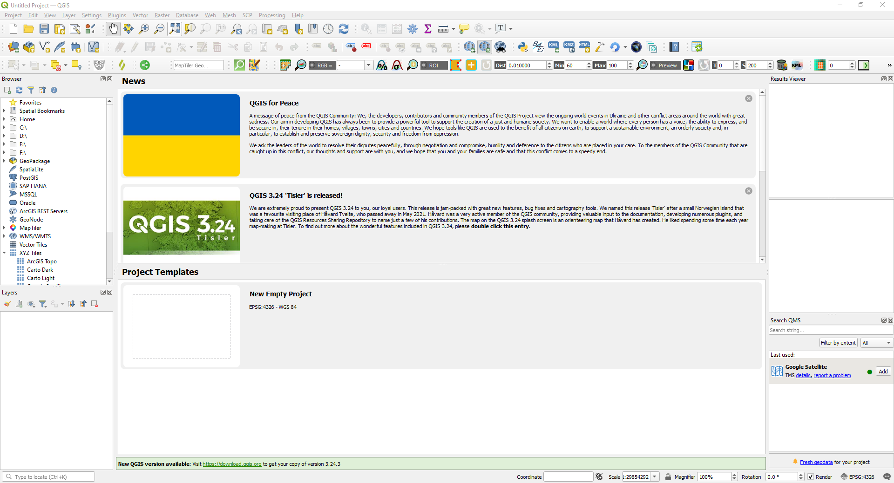
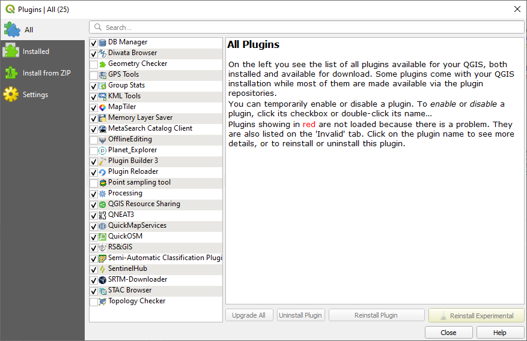
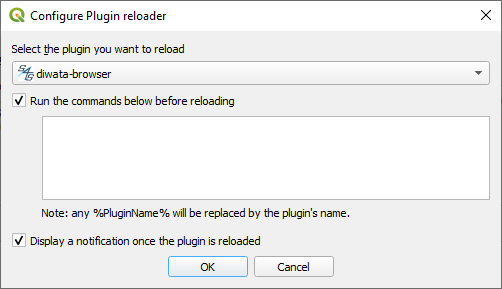

# Development of a QGIS DIWATA Browser
This document describes how to continue this development by integrating the source code into QGIS.

### Dependencies
The following are required to develop the plugin.

1. [QGIS](https://qgis.org/en/site/forusers/download.html)
2. [QGIS Plugin Builder 3](https://plugins.qgis.org/plugins/pluginbuilder3/)

### Setting up the source code

<figure markdown align="center">
   
   <figcaption>Setup QGIS source code</figcaption>
</figure>

1. Open QGIS
2. Under `Settings`, go to `User Profiles`, and select `Open Active Profile Folder`.
3. A folder will open, copy this directory.
4. Open a command line interface and go to the copied directory.

		cd <active profile folder>

5. Clone source code in the directory

		git clone https://github.com/grasped/qgis-diwata-browser.git

### Reading the plugin
Add the plugin to the installed plugins.

<figure markdown align="center">
   
   <figcaption>Setup QGIS plugin</figcaption>
</figure>

1. Under `Plugins`, go to `Manage and Install Plugins...`.
2. Click `Abort Fetching` in the dialog box.
3. In the Plugins dialog box, go to `All` tab, look for `Diwata Browser` and check the checkbox.
4. Close the dialog box.

### Configure the plugin to Plugin Reloader
In order to test changes in the source code, QGIS must re read the plugin. It does so using the `Plugin Reloader`. Configure the default to `Diwata Browser`.

<figure markdown align="center">
   
   <figcaption>Setup QGIS plugin reloader</figcaption>
</figure>

1. Under `Plugins`, go to `Plugin Reloader`, and select `Configure`.
2. The `Configure Plugin reloader` dialog box will appear.
3. Under the `Select the plugin you want to reload` dropdown, select `Diwata Browser`.
4. Check all the checkboxes.
5. Close the dialog box.

### Making changes
If the plugin is being improved, the changes can be tested by reloading it.

1. Use your favorite text editor to edit the cloned source code.
2. Under `Plugins`, go to `Plugin Reloader`, and select `Reload plugin: diwata-browser`. This can also be done by `CTRL+F5`. This can also be done by clicking the reload logo in the toolbar.