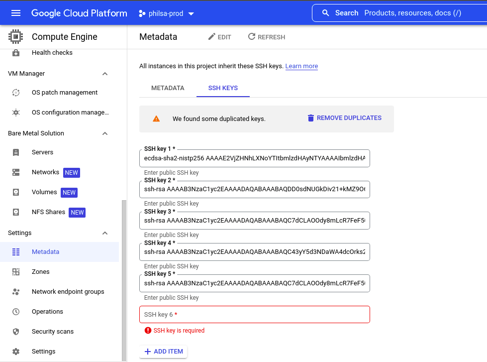

# PhilSA Google Cloud Platform

## Adding SSH keys

SSH keys can be added to instances through the Google Cloud Platform dashboard. To do this, go to `Compute Engine > Settings > Metadata > SSH Keys` and add your own public keys. After doing this, you should be able to SSH the instances through `your-username@ip-address-of-the-instance`.

For more info on this, refer to [this blog by bitnami](https://docs.bitnami.com/google/faq/get-started/connect-ssh/).