# Data Processing Tools User Guide

## Installation

### Requirements

The following are required in order to use the Data Processing Tools software.

1. **Git** - Git controls and manages software repositories. Users can download and install Git depending on their operating system. Users can download Git on this link: https://git-scm.com/downloads

2. **Gitlab Account** - Gitlab stores and monitors changes in DPT software. A Gitlab account linked to GRASPED group is needed to view the DPT repository. The account must use an SSH key on their machine. Use this instruction to set up SSH key: https://docs.gitlab.com/ee/ssh/.

3. **Anaconda** - Anaconda is the distribution of the Python packages required by the DPT software. Use this instruction to install Anaconda dependending on the platform: https://docs.anaconda.com/anaconda/install/windows/

4. **Rclone** - Rclone is a command line program to manage files on cloud storage. This program is needed in order to synchronize products to your local machine. Use this instruction to download Rclone: https://rclone.org/downloads/

### Configuring Rclone

To configure Rclone with the S4S Google Drive, follow these steps:

1. It is recommended to copy the Rclone download to your GRASPED folder.

        (base) C:\User\Documents\GRASPED\rclone-v1.54.0-windows-amd64 >

2. From your rclone directory, type in the following:

        > rclone config

3. Type in the following to create a new remote.

        e/n/d/r/c/s/q> n

4. Type a name for the remote, in this case, it is recommended to name it with:

        name> s4s-drive

5. Type in the following to select Google Drive:

        Storage> drive

6. Press enter to set default for client_id.

        client_id>

7. Press enter to set default for client_secret.

        client_secret>

8. Type in the following to set the scope of your access.

        scope> 1

9. Press enter to set default for client_secret.

        root_folder_id>

10. Press enter to set default for service_account_file.
    
        service_account_file>

11. Type in the following to select say no to editing advanced config:

        y/n> n

12. Type in the following to select say yes to use auto config:

        y/n> y

13. This will open a browser in which you are asked to login your google account. Choose your S4S google account.

14. If needed, enter your password.

15. Click “Allow” to allow access of rclone to your drive as well as the S4S drive.

16. Return to the Anaconda prompt.

17. Type in the following to say no to set the config as team drive:

        y/n> n

18. Press enter or say yes to set the config.

        y/e/d> y

19. Finally, enter the following to exit the rclone config.

        e/n/d/r/c/s/q> q

20. You must be returned to your rclone directory.

### Data Processing Tools Installation
The following installs Data Processing Tools on your machine.

#### On Windows

1. Open Anaconda Prompt.
2. Go to the directory where you want to save the DPT software. Ex.

        (base) C:\User\Documents\GRASPED >

3. Run each line of code:
        cd Documents\GRASPED
        git clone git@gitlab.com:grasped/data-processing-tools.git
        cd data-processing-tools
        conda create -n data-processing-tools -c conda-forge python=3.7 gdal rasterio geopandas fiona opencv cartopy arosics pyqt
        conda activate data-processing-tools
        pip install -r requirements.txt --user

#### On Debian

1. Open a terminal.
2. Go to the directory where you want to save the DPT software. Ex.

        (base) /home/User/Documents/GRASPED $

3. Run each line:

        cd Documents/GRASPED
        git clone git@gitlab.com:grasped/data-processing-tools.git
        cd data-processing-tools
        conda create -n data-processing-tools python=3.7
        conda activate data-processing-tools
        conda install -c menpo opencv
        conda install -c conda-forge gdal=2.4.4 rasterio pyproj pyqt
        pip install -r requirements.txt

## Graphical User Interface (GUI)
### Start
1. To start DPT GUI, go to the directory of DPT software. Ex.

        (base) C:\...\GRASPED\data-processing-tools >

2. Activate the environment.

        conda activate data-processing-tools

3. Launch the GUI.

        python data_processing_tools_gui.py

4. The GUI shall appear.
<figure markdown>
   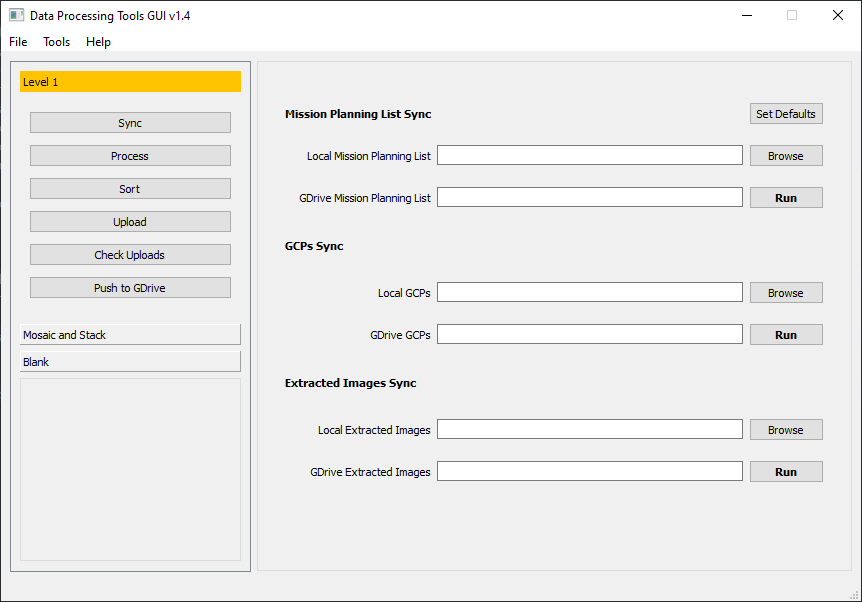
   <figcaption>DPT GUI</figcaption>
</figure>

### Configurations
The default settings are introduced to set a directory, file or variable that are recurring in the DPT such as the Mission Planning List. To open the default setting dialog, simply:

1. Click File on the Menu Bar.

2. Click Configurations.

3. The Configurations dialog box will open.

#### Level 1
The Level 1 configuration are settings to Level 1 processes -- Sync, Process, etc. To edit, use the Browse button or paste new configuration and click OK.
<figure markdown>
   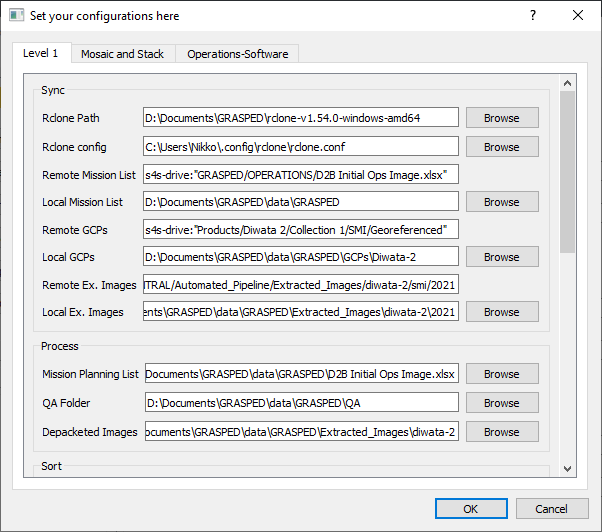
   <figcaption>Configurations for Level 1 Processing</figcaption>
</figure>

#### Mosaic and Stack
The Mosaic and Stack configuration are settings to Mosaic and Stack processes -- Sync, Process, etc. To edit, use the Browse button or paste new configuration and click OK.
<figure markdown>
   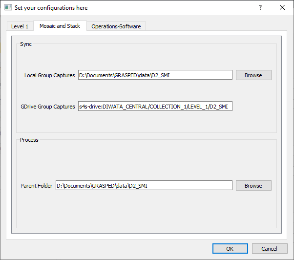
   <figcaption>Configurations for Mosaic and Stack</figcaption>
</figure>

#### Operations-Software
The Operations-Software configuration sets the credentials for Operations-Software related upload.
<figure markdown>
   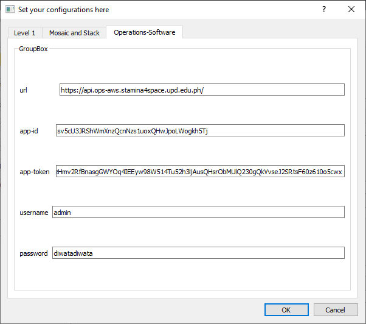
   <figcaption>Configurations for Operations-Software</figcaption>
</figure>

### Level 1
The following are Level 1 processes in Data Processing Tools GUI.

#### Sync Data
The following are the steps for Synchronizing data from the S4S Google Drive.
<figure markdown>
   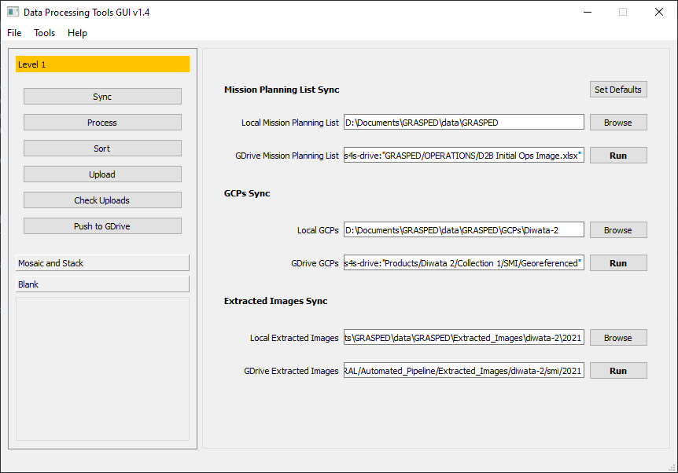
   <figcaption>Level 1 Sync</figcaption>
</figure>

1. In the Side Panel, click Level 1.
2. On the collapsed panel under Level 1, click Sync.
3. Fill the fields with locations or click Set Defaults if there are pre-configurations. Check field description from the table below.
4. Click Run for Mission Planning List Sync.
5. When the process is done for Mission Planning List sync, click Run for GCPs Sync.
6. Lastly, click Run for Extracted Images Sync after GCPs sync is done.

| Field   | Description              |
| -------------- | ------------------------ |
| Local Mission Planning List | Directory where the mission planning list needs to be saved. |
| GDrive Mission Planning List | Location of mission planning list in Drive. |
| Local GCPs        | Directory where to save GCPs.        |
| GDrive GCPs | Location of GCPs in Drive. |
| Local Extracted Images | Directory where extracted images need to be saved. |
| GDrive Extracted Images        | Location of extracted images in Drive.        |

#### Process
The following are the steps for Level 1 processing.
<figure markdown>
   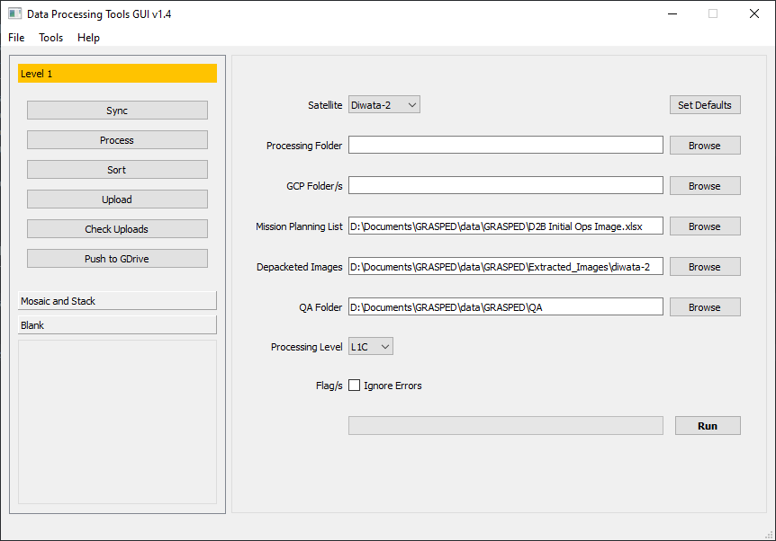
   <figcaption>Level 1 Process</figcaption>
</figure>

1. Under Level 1 panel, click on Process.
2. Fill the fields with valid directories and click Set Defaults if there are pre-configurations. Check the field descriptions from the table below.
3. Click Run.

| Field   | Description              |
| -------------- | ------------------------ |
| Satellite | Selection of which satellite products are to be processed. |
| Processing Folder | Location of where to save the output of the process. |
| GCP Folder/s        | Folder/s of GCPs that are needed in the process.        |
| Mission Planning List | File path of mission planning list. |
| Depacketed Images | Location of extracted images from Sync. |
| QA Folder        | Location where to save output for QA.        |
| Processing Level | Selection of extent of process. |
| Ignore Errors        | Checkbox to ignore errors during processing.        |

#### Sort
The following are steps for sorting Level 1 processed files for distribution.
<figure markdown>
   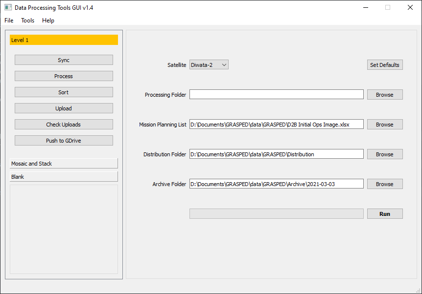
   <figcaption>Level 1 Sort</figcaption>
</figure>

1. Under Level 1 panel, click on Sort.
2. Fill the fields with valid directories and click Set Defaults if there are pre-configurations.
3. Click Run.

| Field   | Description              |
| -------------- | ------------------------ |
| Satellite | Selection of which satellite products are to be processed. |
| Processing Folder | Location of where to save the output of the process. |
| GCP Folder/s        | Folder/s of GCPs that are needed in the process.        |
| Mission Planning List | File path of mission planning list. |
| Distribution Folder | Directory where to save sorted captures. |
| Archive Folder       | Directory where to save sorted archives for archiving.        |

#### Upload
The following are steps for uploading sorted Level 1 processed files for distribution.
<figure markdown>
   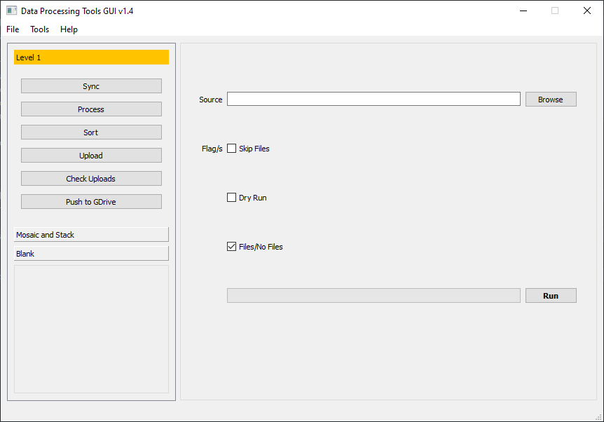
   <figcaption>Level 1 Upload</figcaption>
</figure>

1. Under Level 1 panel, click on Upload.
2. Fill the fields with valid directories and click Set Defaults if there are pre-configurations.
3. Click Run.

| Field   | Description              |
| -------------- | ------------------------ |
| Source | Directory of sorted captures from the Sort process. |
| Skip Files | Checkbox to ignore compression of captures. |
| Dry Run        | Checkbox to check if there are available files to upload.       |
| Files/No Files |  |

#### Check Uploads
The following are the steps for checking successful uploads for Level 1 processed products.
<figure markdown>
   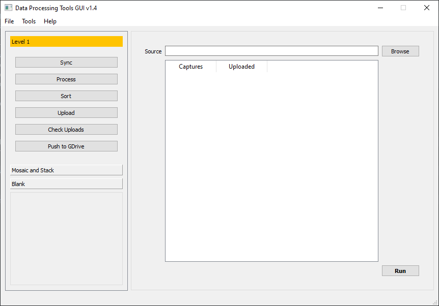
   <figcaption>Level 1 Check Uploads</figcaption>
</figure>

1. Under Level 1 panel, click on Check Uploads.
2. Select a Distribution folder where processed Level 1 products are located. This is the same folder used to upload these products.
3. Click Run.
4. The result will show each capture and their uploaded state -- True or False.

| Field   | Description              |
| -------------- | ------------------------ |
| Source | Directory of sorted captures from the Sort process. |

#### Push to GDrive
The following steps are for uploading archive data to S4S Google Drive.
<figure markdown>
   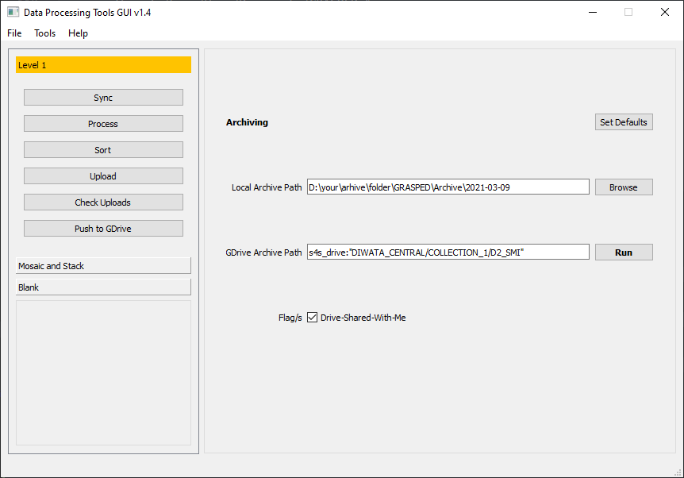
   <figcaption>Level 1 Push to GDrive</figcaption>
</figure>

1. Under Level 1, click on Push to GDrive.
2. Fill the fields with correct paths or click Set Defaults if pre-configurations are present.
3. Click Run.

| Field   | Description              |
| -------------- | ------------------------ |
| Local Archive Path | Location of archive captures. |
| GDrive Archive Path | Location where to save archive captures in S4S Google Drive. |
| Drive-Shared-With-Me        | Checkbox if the Drive location is not owned or not.       |

### Mosaic and Stack
The following process for SMI mosaicing and stacking.

#### Sync
The following are steps for syncing Diwata-2 SMI products to your local machine.
<figure markdown>
   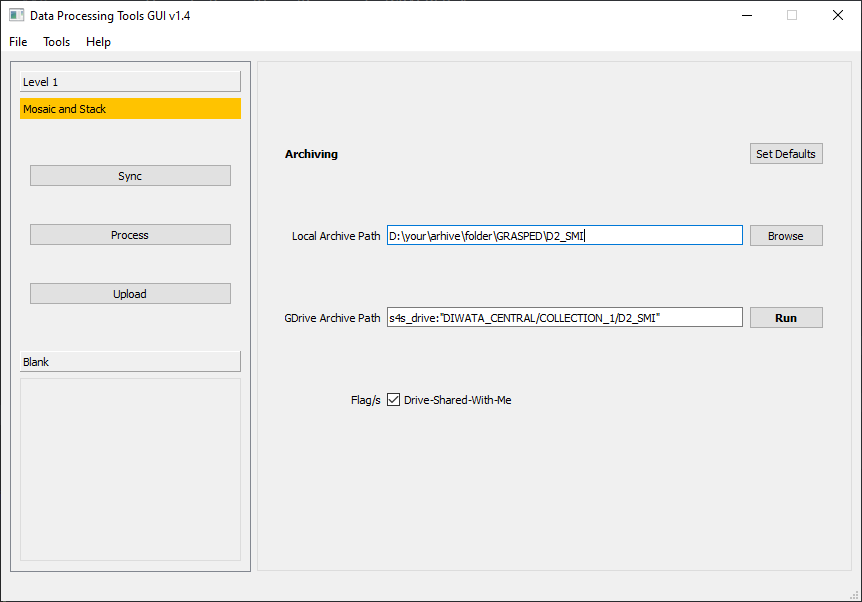
   <figcaption>Mosaic and Stack Sync</figcaption>
</figure>

1. In the side panel, click Mosaic and Stack.
2. Under the collapsed panel Mosaic and Stack, click on Sync.
3. Fill the fields with correct paths or click Set Defaults if pre-configurations are present.
4. Click Run.

| Field   | Description              |
| -------------- | ------------------------ |
| Local Group Catures | Location where to save group captures. |
| GDrive Group Captures | Location where to save archive captures in S4S Google Drive. |
| Drive-Shared-With-Me        | Checkbox if the Drive location is not owned or not.       |

#### Process
The following processes SMI products to mosaic and stacked images.
<figure markdown>
   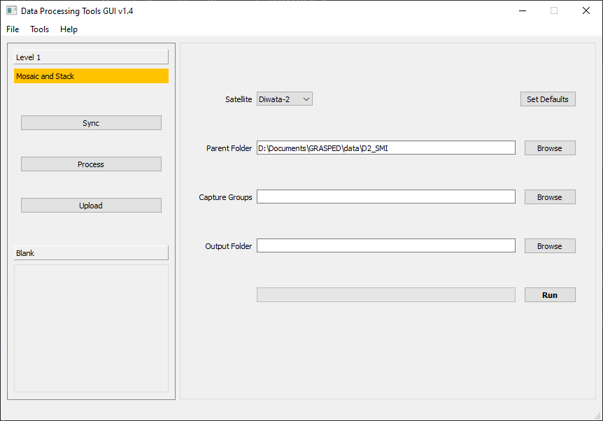
   <figcaption>Mosaic and Stack Process</figcaption>
</figure>

1. Under the Mosaic and Stack side panel, click on Process.
2. Fill the fields with correct paths or click Set Defaults if pre-configurations are present.
3. Click Run.

| Field   | Description              |
| -------------- | ------------------------ |
| Satellite | Selection of which satellite the group captures is to be processed. |
| Parent Folder | Location of capture groups in the computer. |
| Capture Groups        | Folder/s of individual capture groups.       |
| Drive-Shared-With-Me        | Checkbox if the Drive location is not owned or not.       |

#### Upload
The following are steps to upload SMI Mosaic-ed and Stacked products.
<figure markdown>
   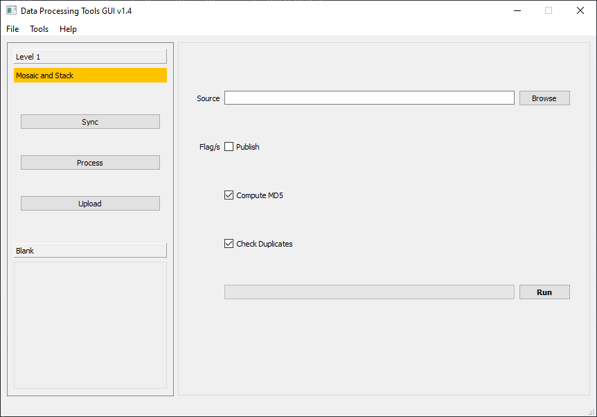
   <figcaption>Mosaic and Stack Upload</figcaption>
</figure>

1. Under the Mosaic and Stack side panel, click on Upload.
2. Select a parent folder or folder where mosaic and stack process results are found. This is the same as the output folder from the Mosaic and Stack Process step.
3. Check Publish if these products are checked and should be seen for the public and leave uncheck if data needs more checking or confidentiality.
4. Check the Compute MD5 to incorporate unique file IDs to each product.
5. Check the Check Duplicates to ignore similar files based on their MD5 sum.
6. Click Run.

| Field   | Description              |
| -------------- | ------------------------ |
| Source | Location of processed capture groups or the mosaic and stacked outputs. |
| Publish | Checkbox to set the upload as published. Check only if no further confidentiality assurance is needed. |
| Compute-MD5        | Checkbox to compute a unique identifier of the file. This is to check if a reupload is the same file as before.       |
| Check Duplicates        | Checkbox to test if the capture group is already uploaded with the same MD5.       |

### Debugging and Closing the GUI
For now, close the application using the close button if the following are encountered:
1. If the application crashed.
2. An error occurred in the Anaconda Prompt.
3. If the progress bar does not move.

## Updating Data Processing Tools
There can be new features that require new dependencies. In this case, the software needs to be updated and reinstalled. Follow these steps to update and reinstall DPT. Refer to the Software Systems team for new features.

### Basic Update
1. Backup the config file inside the DPT software folder.
2. Open Anaconda Prompt, go to the DPT directory.

        (base) C:\...\data-processing-tools >

3. Activate the environment.

        conda activate data-processing-tools

4. Pull the updated repository.

        git pull

### Update The Needs Reinstall
1. Go to the directory of DPT software.

        (data-processing-tools) C:\...\data-processing-tools >

2. If the environment is activated, deactivate it.

        conda deactivate

3. Delete the environment.

        conda remove --name data-processing-tools --all

4. Get the updates from the repository.

        git pull

5. [Section 1.3](#data-processing-tools-installation) will be updated whenever there are new dependencies for DPT. Follow that section to reinstall DPT depending on your operating system. Start with line 4 for Windows and line 4 for Debian.

## Links
- [Data Processing Tools on Gitlab](https://gitlab.com/grasped/data-processing-tools/)
- [Original Data Processing Tools - User Manual](https://docs.google.com/document/d/1pdwh1z4jj-V-b0lxuiCSdD74bkrm_1qysvXjbTld4Hc/edit#_)