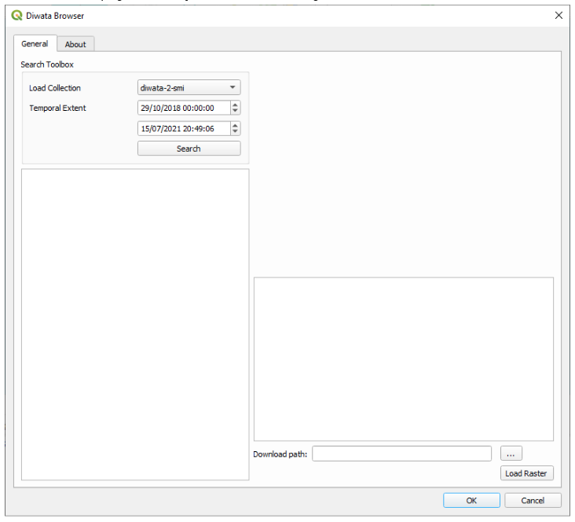
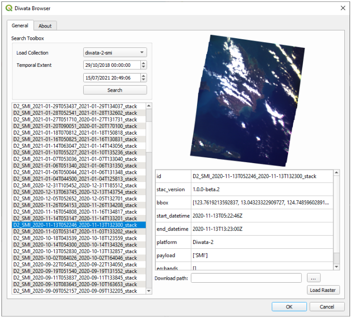

# Overview
The Diwata Browser is a QGIS plugin that enables users to browse and load Diwata microsatellite images. It uses the STAMINA4Space operations-software backend to serve these images. The plugin utilizes the Spatiotemporal Asset Catalog (STAC) specification to describe the images information. The plugin can browse different collections from the operations-software catalog. Furthermore, the plugin can load selected items based on the loaded collection. The software is free to use.

The repository of this software can be found on: https://gitlab.com/cnpante/diwata-browser

# Installation

## Requirements
The following are required for the installation of the software.

### QGIS
QGIS is a free and open source geographic information system software. QGIS can be installed through: https://www.qgis.org/en/site/.The minimum version required to run the plugin is 3.0.

## Installing the Beta Version
The beta version of Diwata Browser is a release for testing. It uses the development web-backend to search and serve the images. It can be installed using a .zip file attachment once a beta release comes out. This version can be installed using the following steps:

1. Download the zip attachment on the release note.
2. On the QGIS menu bar, go to Plugins and select Manage and Install plugins.
3. Using the Install from ZIP tool, select the download zip file and install the plugin.
4. Launch the plugin from the menu bar under Plugins.

## Installing the Production Version
The production version of Diwata Browser is a release that is available on the QGIS Plugin repository. It uses the production based web-backend to search and serve the images. This version can be installed using the following steps:

1. On the QGIS menu bar, go to Plugins and select Manage and Install plugins.
2. The Plugins manager will pop out and from the All tab, search for Diwata Browser.
3. Select Diwata Browser from the result and Install the plugin.
4. Launch the plugin from the menu bar under Plugins.

# Usage

The following are steps on how to use the Diwata Browser plugin.

1. Launch the plugin from the QGIS menu bar under Plugins.

2. The Diwata Browser dialog box will pop out. Under the General tab, select from different collections from the backend catalog service. For now, the plugin only supports the Diwata-2 SMI collection.

3. Select the temporal extent in which you want items/images to return. The first date time selector is for start datetime and the second is for end datetime in which are the start and end capture time for the respectively.

4. Press Search to begin loading the collection and list the items under it.

5. Once the items are loaded, you can select an item using your mouse or the up and down arrows of your keyboard.

