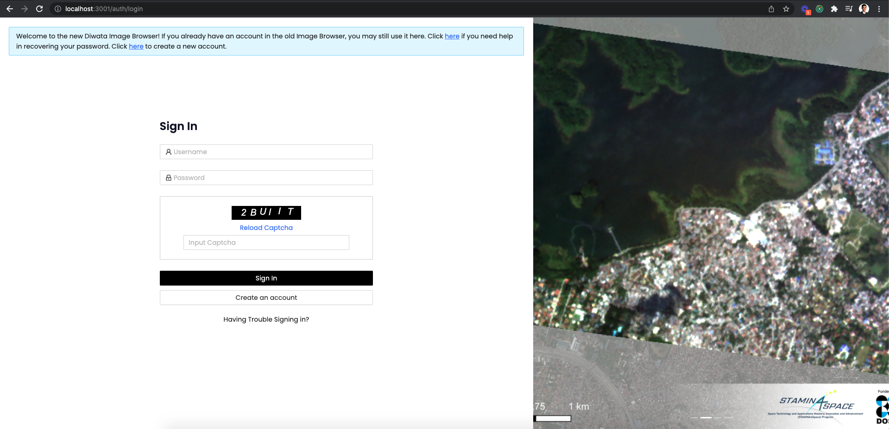
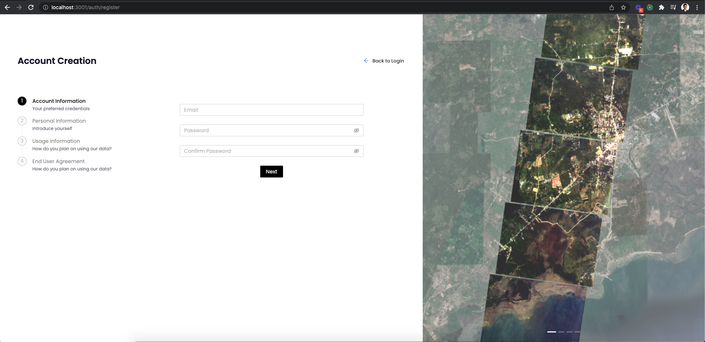
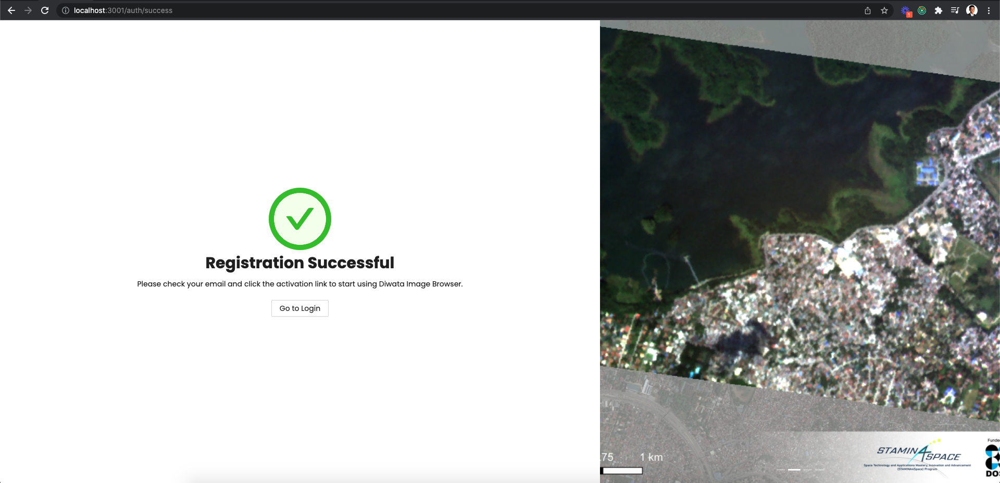
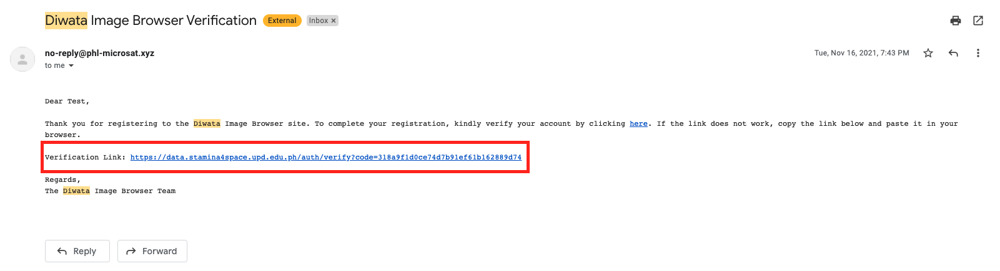
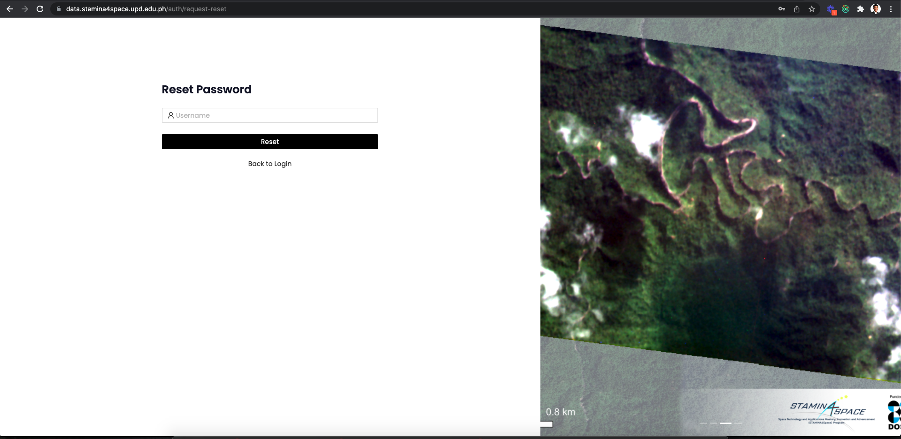
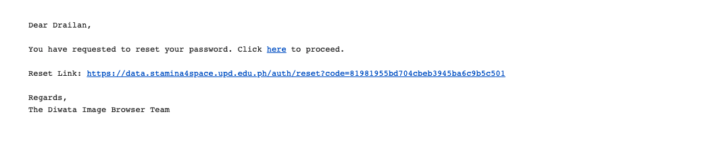
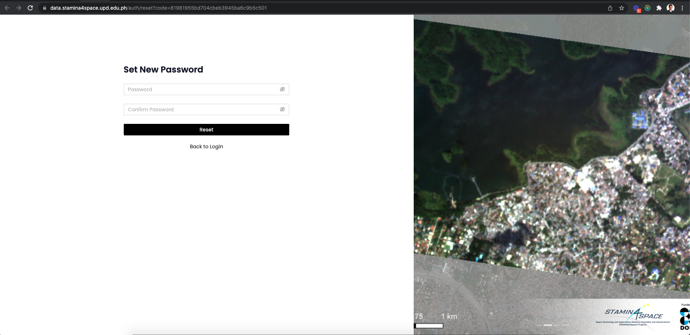
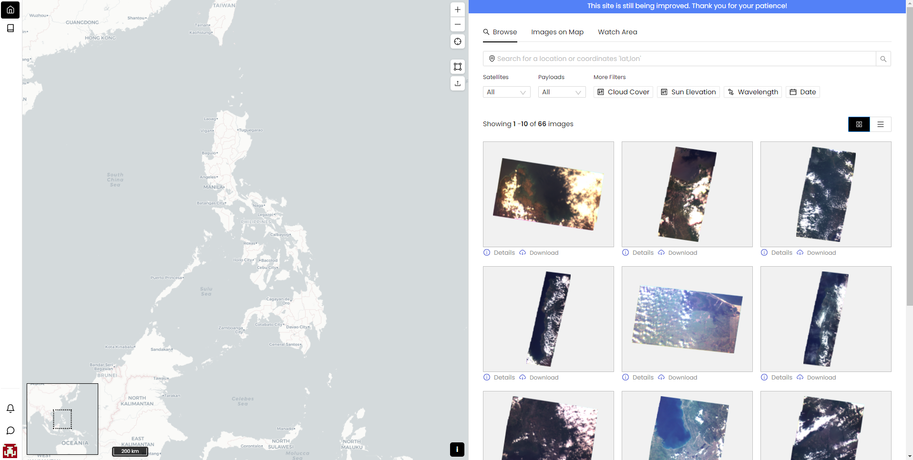

# Image Browser

## Accessing the Website

## Account

You can browse the images on the browser even if you are not a registered user, but in order to download and request images you need to have an account.

### Sign In

Go to `/auth/login` for the login page.

This is the login page of the image browser. You need to login in-order to perform download and request images.

### Creating an Account

To create an account, go to the login page, and click the `Create an Account` button.

Fill the required fields and submit the forms. An email confirming your account will be sent to the email you used to register.

Open your email and find the verfication email that we've sent and click the verification link.

You can now sign-in, once you see the confirmation that the verification has been successful.

### Reset/Forgot Password

To reset or forgot your password, go to login page and click the `Having Trouble Signing in` link.

Enter your email address and wait for the reset password email that will be sent to your email account.

Click the reset link.

Input the new password and confirm the new password.

You can now use your account with your new password.

## Browse Page

The Image Browser can be accessed by any user(with or without account) using this [link](https://data.stamina4space.upd.edu.ph/browse).

## Images on Map Page

## Watch Area Page
