# Image Browser

## Accessing the Website

## Account

You can browse the images on the browser even if you are not a registered user, but in order to download and request images you need to have an account.

### Sign In

Go to `/auth/login` for the login page.

This is the login page of the image browser. You need to login in-order to perform download and request images.

### Creating an Account

To create an account, go to the login page, and click the `Create an Account` button.

Fill the required fields and submit the forms. An email confirming your account will be sent to the email you used to register.

Open your email and find the verfication email that we've sent and click the verification link.

You can now sign-in, once you see the confirmation that the verification has been successful.

### Reset/Forgot Password

To reset or forgot your password, go to login page and click the `Having Trouble Signing in` link.

Enter your email address and wait for the reset password email that will be sent to your email account.

Click the reset link.

Input the new password and confirm the new password.

You can now use your account with your new password.

### Edit Profile

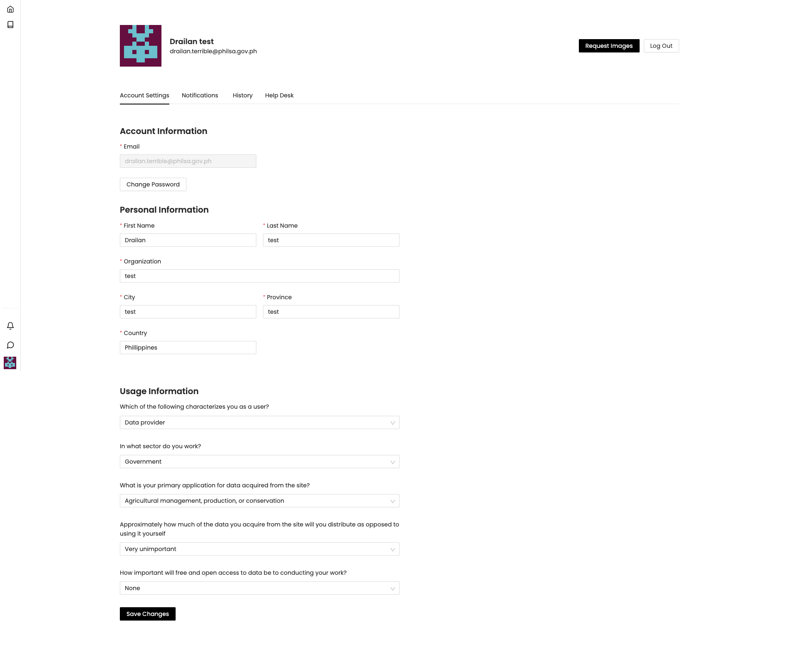

You can edit your profile on `/user/account` url. You can also change your password and personal information except for your email.

### Notifications

You can access all your requested images and subscriptions in the notification page. `/user/notifications`. Click `View` link to show the images on the browser page.

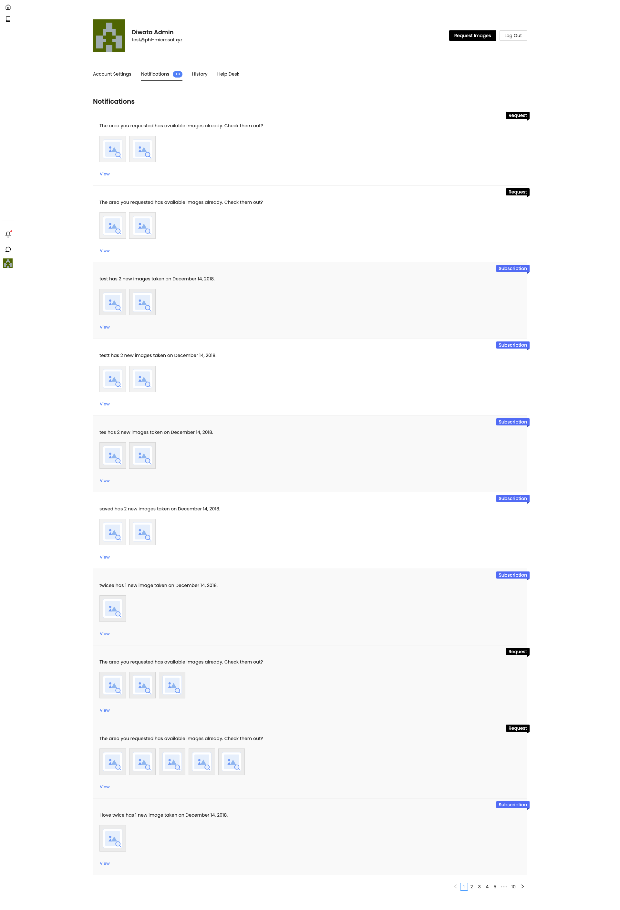

### History

You can access your past downloads inside the History page. You can re-download these images by click the `Download` button inside the history item.

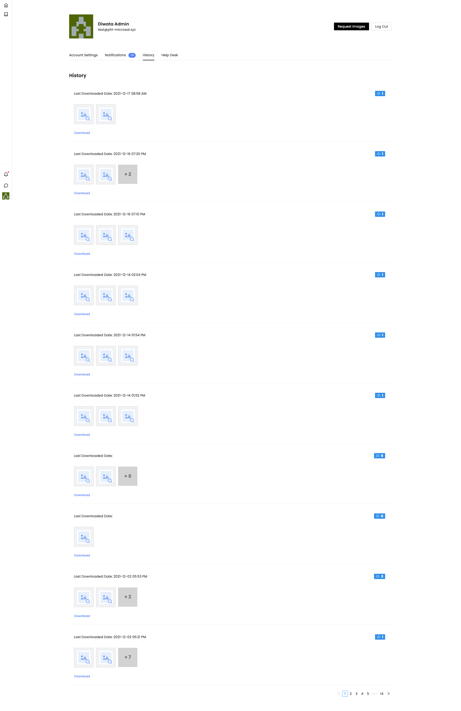

### Helpdesk

You can submit an inquiry, concern and suggestion using the Helpdesk module.

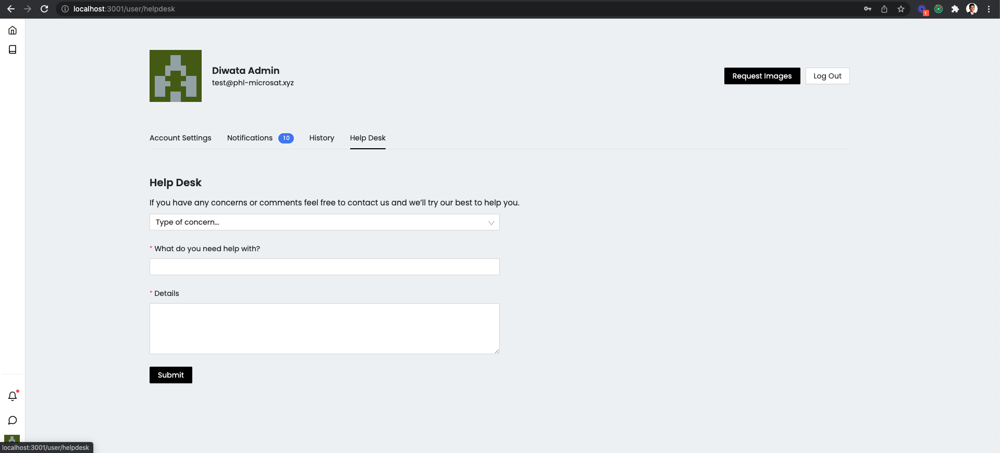

## Navigate Browser

The Image Browser can be accessed by any user(with or without account) using this [link](https://data.stamina4space.upd.edu.ph/browse).

### Filter image results

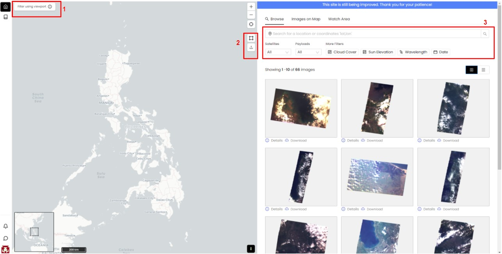

Image results shown can be customized by:

1. Filter using viewport
    - By activating this feature, image results will be recomputed when map is panned or zoomed in/out. The button color will change to black when the feature is activated, and a dotted border will be displayed around the map. To deactivate the feature, click the button. 
2. Using map tools
    - Draw tool
        - Click the button to start drawing. After selecting an area on map, image results will be updated.
    - Upload vector file
        - Select a shapefile to upload. Accepted file format is `.zip` only.
        - Once file is uploaded, the map will look like this. 
        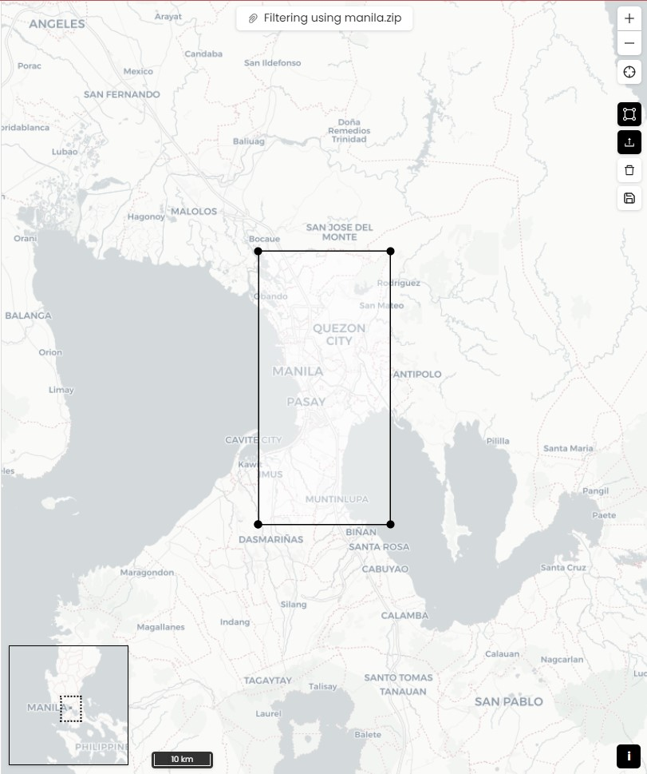
        - Upload ang draw tools will be activated and a polygon will be drawn on map.
        - New map button will be shown at top with this format: `Filtering using <filename>`. Click this to recenter map on drawn polygon.
        - To deactivate this filter, click `Clear filters` button below the upload tool.
3. Selecting filters
    - Search Bar - Type a location name or coordinates in latitude, longitude
    - Basic filters
        - Satellite - Single select of satellite
        - Payloads - Single select of payload
        - Cloud cover - Use the slider to select range of elevation from 0 - 100 %
        - Sun Elevation - Use the slider to select range of elevation from 0 - 180 °
        - Wavelength - multiple select of wavelength values in nm
        - Date - select date range

### View images on map

When you hover on an image from the list, a grey colored polygon is shown on the map so you can have an idea where that image should be on the map. There is no limit on how many can be selected, just click the image to view it on map. All selected images will have a check mark on the upper ride side of the tile.

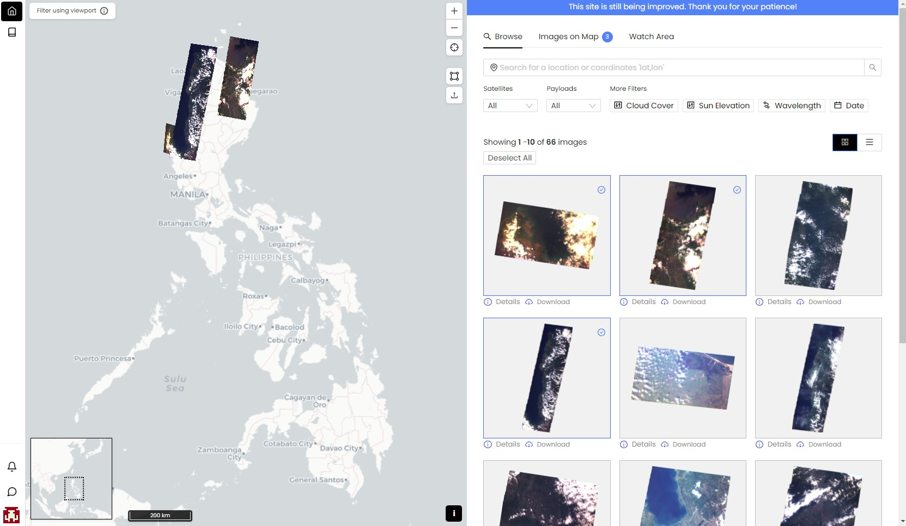

All viewed images are listed on `Images on Map` tab. Click the tab to see all selected images. From this tab, you can download or remove all, change the order of images, or the opacity of each.

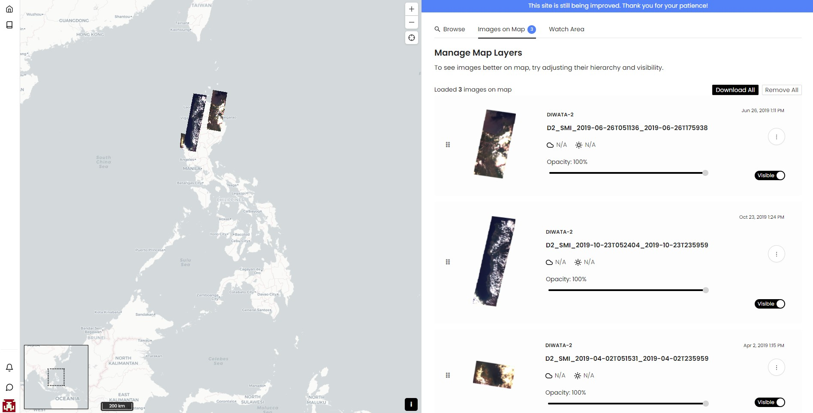

From the sample selected images, you can see that the 2nd image overlaps the 3rd image on map. You can change the order of the images by dragging the icon (left side of the image), then place it on your preferred order. Changing the order of the 2nd and 3rd images, the map will look like this.

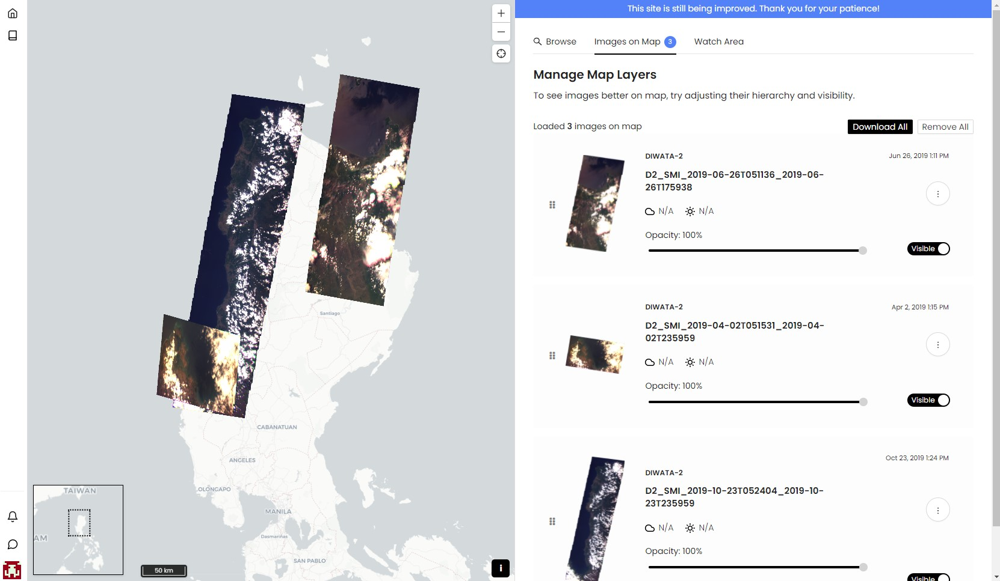

### Request image for an area

If an area you selected has no available image, you may request by clicking the `Request Images` button. This feature is for registered users only. If you are not yet registered, a `Log in` button is shown instead of Request Images button.

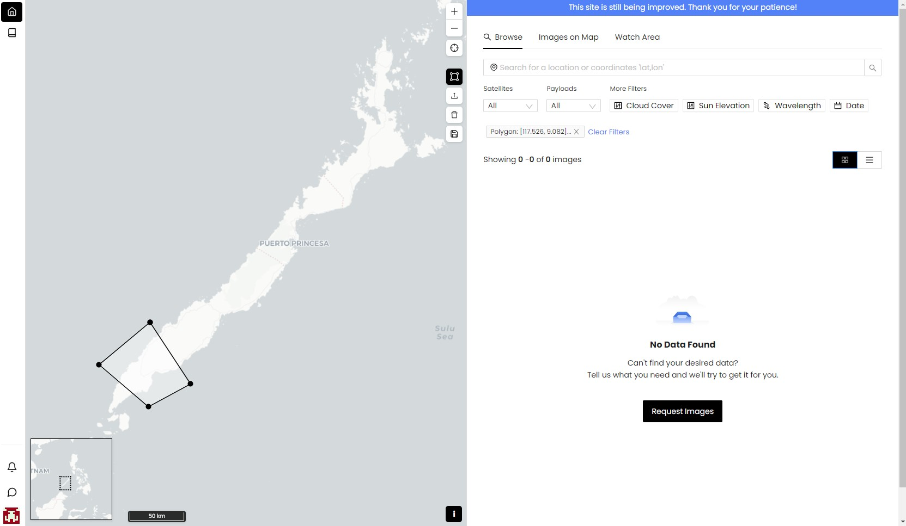

Once `Request Images` button is clicked, an image request form will be shown. Basic information and area of interest is initially filled out. You can change the polygon by drawing a new one or upload a shapefile. Basic informaion cannot be changed in this form. 
Information saved on your account settings will be used in image request form. If you want to change the basic information, go to account settings. After filling out the image request form, click OK to submit.

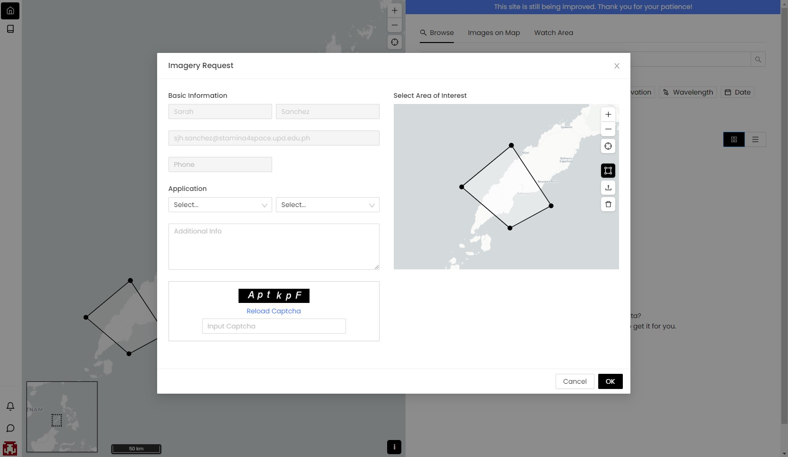

### Create watch area

If you want to get notified if there are new images on a specific location, you can use the watch area feature. This feature is for registered users only.

<!-- You can create a subscription to your desired area by creating a watch area. You will be notified if there are new images from that location. -->

To create a watch area, draw a polygon or upload a shapefile on map. Click the `Save` button, below the clear filter button, on map. Write a name for the area you want to watch. Click Save to submit.

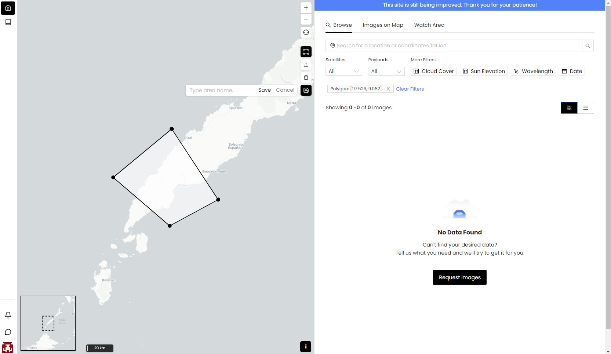

Your new watch area will be added to the list in `Watch Area` tab. You may view the area on map or remove the watched area. 

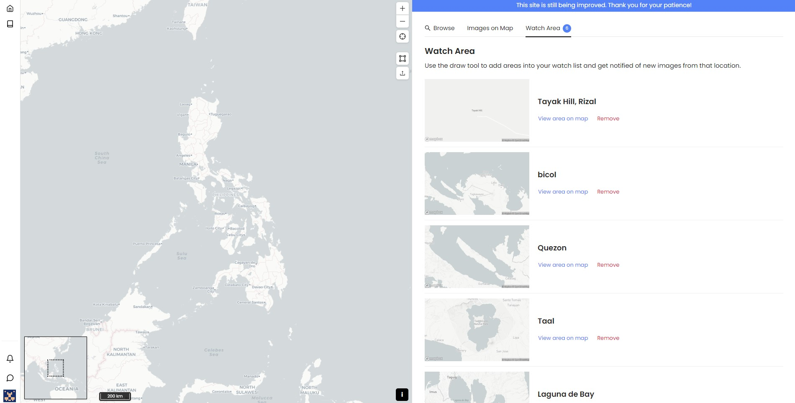

Check the `Notifications` page if there are new images on your watched areas. If there are notifications, you can download new images or view the images on map.

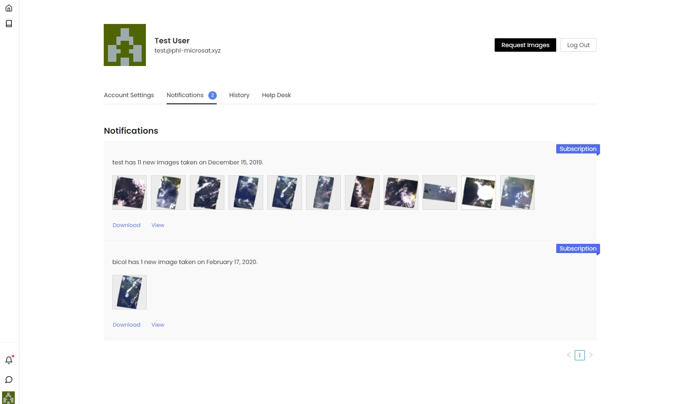

If you click the view link from the notifications, you will be redirected to `Images on Map` view, showing all the new images on the list and images are added on map.
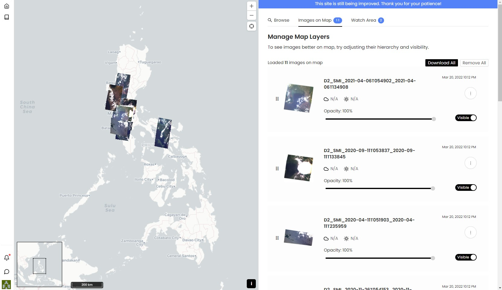
