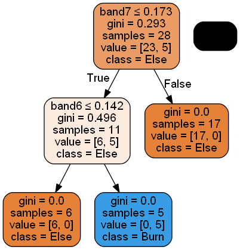
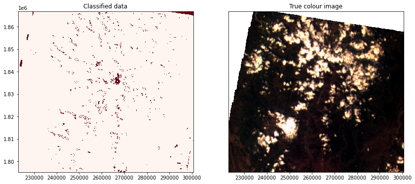

# Performing a classification using Diwata-2 data

#### Description
This notebook demonstrates different analysis that can be performed in the Open Data Cube using the Diwata-2 SMI dataset.

#### Background
Diwata-2 has been able to capture 84% (as of October 30, 2021) of the land cover of the Philippines. Using these images and the previous guides, we can perform an analysis to understand some phenomena on Eath's surface. We can begin with some question.

## Example 2. Benguet Fire Extent using SVM
### Choose a study area
```
lat = (16.1899, 16.8523)
lon = (120.3772, 121.1886)
```
### Display study area
```
from ph_odc_tools import display_map

display_map(x=lon, y=lat)
```
### Extract training data using a shapefile
For any classification analysis using Earth observation images, a training data is required. Training data are selected features from the images depending on the analysis. A shapefile is used to select the properties or values from each band of a feature. The code below reads and display a shapefile.
```
import geopandas as gpd

shp_file = "data/benguet_training_data/benguet_training_data.shp"
gdf = gpd.read_file(shp_file)
```
### Examining the training set
```
gdf.head()
```
```
gdf[~gdf['Class_name'].isnull()]
```
```
gdf.explore()
```
```
import numpy as np

gdf = gdf.astype({"Class": np.int})
gdf.Class.dtype
```


```

import datacube
from dea_tools.classification import collect_training_data, predict_xr

query = {
    'time': '2020-02-29',
    'resolution': (-122, 122),
    'output_crs': 'EPSG:32651',
}

field = 'Class'
zonal_stats = 'median'
ncpus = 1

def custom_function(query):
    dc = datacube.Datacube(app="benguet_fire_extent")
    ds = dc.load(product="diwata2_smi_l1c", **query)
    ds = ds.where(ds > 0)
    
    return ds
    


column_names, model_input = collect_training_data(
                                    gdf=gdf,
                                    dc_query=query,
                                    ncpus=ncpus,
                                    feature_func=custom_function,
                                    field=field,
                                    zonal_stats=zonal_stats
                                    )
```

```
model_input[:, 0] = np.where(model_input[:, 0] == 18, 1, 0)
model_input[:, 0]
```

```
from sklearn import model_selection

# Split into training and testing data
model_train, model_test = model_selection.train_test_split(model_input,
                                                           stratify=model_input[:, 0],
                                                           train_size=0.8,
                                                           random_state=0)
print("Train shape:", model_train.shape)
print("Test shape:", model_test.shape)
```

```
# Select the variables we want to use to train our model
model_variables = column_names[1:]

# Extract relevant indices from the processed shapefile
model_col_indices = [column_names.index(var_name) for var_name in model_variables]
model_col_indices
```

```
from sklearn import tree

# Initialise model
model = tree.DecisionTreeClassifier(max_depth=10)
```

```
# Train model
model.fit(model_train[:, model_col_indices], model_train[:, 0])
```


```
import matplotlib.pyplot as plt

# This shows the feature importance of the input features for predicting the class labels provided
plt.bar(x=model_variables, height=model.feature_importances_)
plt.gca().set_ylabel('Importance', labelpad=10)
plt.gca().set_xlabel('Variable', labelpad=10);
```

```
from io import StringIO
import pydotplus
from IPython.display import Image

# Prepare a dictionary of class names
class_names = {1: 'Burn',
               0: 'Else'}

# Get list of unique classes in model
class_codes = np.unique(model_train[:, 0])
class_names_in_model = [class_names[k] for k in class_codes]

# Plot decision tree
dot_data = StringIO()
tree.export_graphviz(model,
                     out_file=dot_data,
                     feature_names=model_variables,
                     class_names=class_names_in_model,
                     filled=True,
                     rounded=True,
                     special_characters=True)

graph = pydotplus.graph_from_dot_data(dot_data.getvalue())
Image(graph.create_png())
```



```
from sklearn.metrics import accuracy_score

predictions = model.predict(model_test[:, model_col_indices])
accuracy_score(predictions, model_test[:, 0])
```

```
# Get extent from input shapefile
xmin, ymin, xmax, ymax = gdf.unary_union.bounds

# Set up the query parameters
pred_query = {
    'time': '2020-02-29',
    'x': (xmin, xmax),
    'y': (ymin, ymax),
    'output_crs': 'EPSG:32651',
    'resolution': (-122, 122),
}

# Use custom function to generate input data
input_data = custom_function(pred_query)
```


```
# Predict landcover using the trained model
predicted = predict_xr(model,
                       input_data,
                       clean=True
                      )
```

```
import matplotlib.pyplot as plt

# Set up plot
fig, axes = plt.subplots(1, 2, figsize=(14, 6))
predicted.Predictions.plot(ax=axes[0],
               cmap='Reds',
               add_labels=False,
               add_colorbar=False)

# Plot true colour image
(input_data[['band4', 'band2', 'band1']]
 .squeeze('time')
 .to_array()
 .plot.imshow(ax=axes[1], robust=True, add_labels=False))

# Remove axis on right plot
axes[1].get_yaxis().set_visible(False)

# Add plot titles
axes[0].set_title('Classified data')
axes[1].set_title('True colour image');
```


### Links
[Go back to OpenDataCube User Guide](index.md)