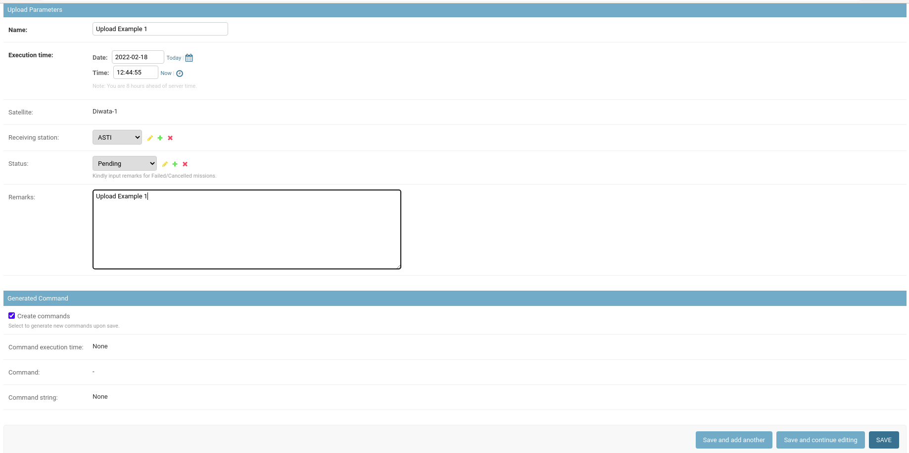

# Diwata Operations Software User Guide

The Diwata Operations Software (DOS) is an integrated system containing modules for
managing different components within the satellite operations workflow. The DOS is divided into
three major modules: Missions Management, Data Management, and Satellite Health
Management.

From an architectural standpoint, the DOS serves as a central repository of data for multiple software systems developed in GRASPED.

## Accessing the Website
The Diwata Operations Software may only be accessed by authorized users using this [link](https://ops.stamina4space.upd.edu.ph/).

## Missions Management
The Missions Management module was designed to help in mission planning and management of satellite passes. This module includes automated pass prediction features, similar to the Microsatellite Scheduler, as well as a satellite command generator.

### Acquisition Missions

#### Using the Admin Site

##### Adding a new Acquisition Mission

1. Login to the admin site with your credentials. You may contact the system administrator if you still don't have an account.

2. Look for the Missions module under the MISSIONS_MANAGEMENT subgroup.

3. You may click the Missions button to view and update the current records or the Add button if you want to add a new record.

4. Add the necessary parameters for the mission, and then click Save. You may also choose Save and add another if you wish to save another record, or Save and continue editing if you don't want to view and edit the recorded data.

Some settings are Diwata-2 specific settings so you need to input necessary parameters for the compiler to work properly.

Unchecking this box will prevent the command compiler from executing.

Add the payloads to be used.

**Note:** As of April 5, 2020, generating commands for Diwata-1 will result in TLE errors because Diwata-1 has already been decommissioned. Command Compiler tries to fetch the latest TLE values from the server and will return an error if the TLE's epoch date is older than 7 days.

##### Batch operations for Acquisition Missions

1. Click on the checkbox beside each record to select a record. You may also click the uppermost checkbox to select all the records in the current page.

2. Open the dropdown menu above the table and select the action you want to perform. Then, click Go. 

A prompt will be shown when trying to delete records. Review and confirm that the data can be deleted before proceeding.

**Note:** Please be careful when deleting multiple data. 

### Upload Missions

#### Using the Admin Site

##### Adding a new Acquisition Mission

1. Login to the admin site with your credentials. You may contact the system administrator if you still don't have an account.

2. Look for the Upload missions module under the MISSIONS_MANAGEMENT subgroup.

3. You may click the Upload missions button to view and update the current records or the Add button if you want to add a new record.

4. Add the necessary parameters for the upload mission, and then click Save. You may also choose Save and add another if you wish to save another record, or Save and continue editing if you don't want to view and edit the recorded data.

**Note:** Unchecking Generate commands will prevent the command compiler from executing. This means that the error below will not occur and the record will still be successfully saved but without the generated commands.

**Note:** As of April 5, 2020, generating commands for Diwata-1 will result in TLE errors because Diwata-1 has already been decommissioned. Command Compiler tries to fetch the latest TLE values from the server and will return an error if the TLE's epoch date is older than 7 days.

### Download Missions

**Note:** As of April 5, 2020, generating commands for Diwata-1 will result in TLE errors because Diwata-1 has already been decommissioned. Command Compiler tries to fetch the latest TLE values from the server and will return an error if the TLE's epoch date is older than 7 days.

### ACU Log Download Missions

### Commands and Command Batches
### Reports

## Data Management
The Data Management Module contains tools for storing and accessing images and metadata in different levels of data processing. In this module, users may download images for processing and upload derived products.

A Data Processing Pipeline is also integrated into the module to automate most of the existing Diwata-1 and Diwata-2 Level 1 product generation.

## Satellite Health Management
### ACU Logs
Attitude Control Unit (ACU) log files contain information recorded onboard the satellite describing the state of its positioning and orientation at a given time. The ground station operators download the log files regularly from the satellites and upload them into a cloud service.

Originally, the contents of the files can be inspected by manually running a depacketer software. This process was tedious and only provided information on-demand.

## Admin Management
Alternatively, users can login directly to the operations software backend to have additional access to the database especially when correcting data that are not editable in the Diwata Operations Software. For security purposes, however, not all users who have access to the Diwata Operations Software can login to the admin site. Some users may have limited access as well to protect data integrity. Users can access the site using this [link](https://api.ops.stamina4space.upd.edu.ph/admin/).

Upon logging in, the user will see all the accessible modules and data for viewing, adding, editing, and deleting. Access to these data and modules depends on the permissions granted to the user.

## Links
- [Operations Software](https://ops.stamina4space.upd.edu.ph/)
- [Operations Software Admin Site](https://api.ops.stamina4space.upd.edu.ph/admin/)
- [Operations Software on Gitlab](https://gitlab.com/grasped/operations-software/)
