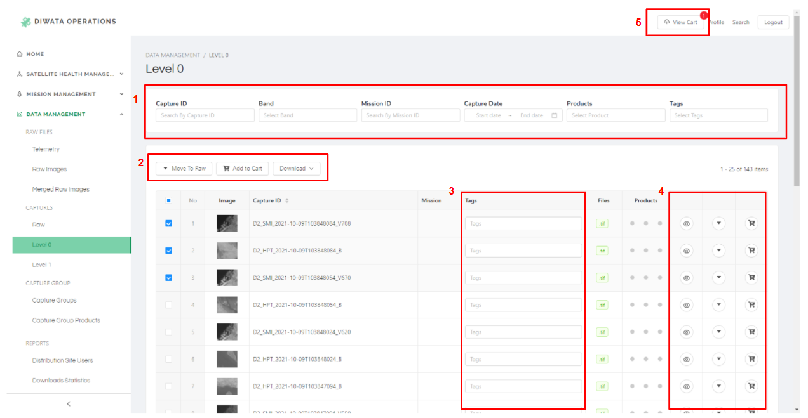
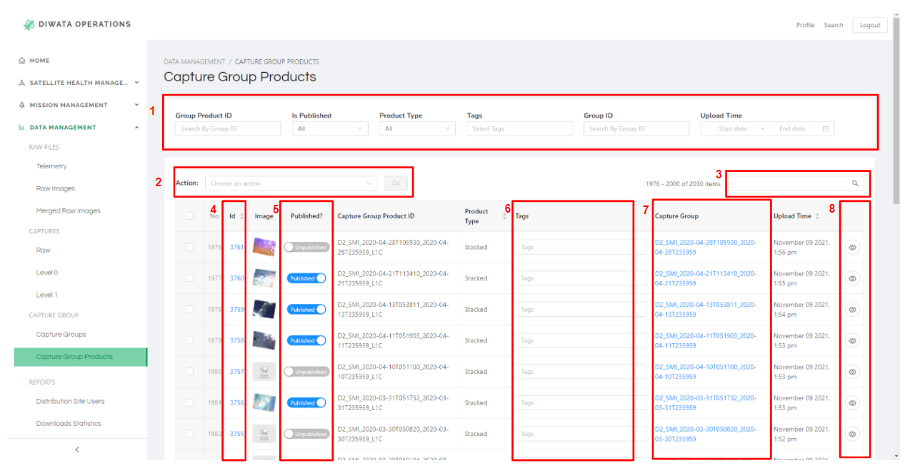

# Diwata Operations Software User Guide

The Diwata Operations Software (DOS) is an integrated system containing modules for
managing different components within the satellite operations workflow. The DOS is divided into
three major modules: Missions Management, Data Management, and Satellite Health
Management.

From an architectural standpoint, the DOS serves as a central repository of data for multiple software systems developed in GRASPED.

## Accessing the Website
The Diwata Operations Software may only be accessed by authorized users using this [link](https://ops.stamina4space.upd.edu.ph/).

## Missions Management
The Missions Management module was designed to help in mission planning and management of satellite passes. This module includes automated pass prediction features, similar to the Microsatellite Scheduler, as well as a satellite command generator.

### Targets

Overview of Targets Page

Page contents:

1. Create new targets
2. Filters
3. Actions (Delete multiple targets)
4. Search bar to find keywords on the table
5. View/edit target details

Filter Description

| Filter Label | Description | List of Values |
| ----- | ----- | ----- |
| Name | Filter by name | ---- |
| Classification | Filter by classification | Integer from 0-5   Default value: All |
| Purpose | Filter by purpose | Agriculture, Agriculture Validation, Agroforestry, Aquaculture, Calibration Validation, Coastal Monitoring, Cultural Heritage, Fisheries, Forest Validation, Forestry, Flood and storm surge, Land Use Change, Ocean Validation, Protected Area, Security, Typhoon, Tourism, Urban, Validation Site(urban)    Default value: All |

#### How to create new entries?

1. Click the `Add Target` button at the upper right side of filters to redirect to Add Target Page.

Add Target Page

 &nbsp;&nbsp;&nbsp;&nbsp; 2. Input name, select target by drawing polygon on the map, tick/untick is active status, select classification and purpose, and input requred bands.
 &nbsp;&nbsp;&nbsp;&nbsp; 3. Name, classification and purpose are required fields.
 &nbsp;&nbsp;&nbsp;&nbsp; 4. After filling out the form, click `Submit` button.
 &nbsp;&nbsp;&nbsp;&nbsp; 5. New target will be added to the table in Targets Page.

#### How to view or update details of a mission?

1. Click the ID of target to redirect to View Target Page.
2. If details are edited, click `Submit` button to update.

### Acquisition Missions

#### How to update status of missions?

Filter Description

| Filter Label | Description | List of Values |
| ----- | ----- | ----- |
| Status | Filter by status | Pending, Captured, Failed, Cancelled, Downloadable, Processed, Not Processed, Distributed   Default value: All |
| Pointing Mode | Filter by pointing mode | Not Determined, Target Pointing, Off Nadir, Nadir, Rpy, Qt, Off Nadir Rpy, Manual Qt   Default value: All |
| Satellite | Filter by satellite | Diwata-1, Diwata-2, Maya-1   Default value: All |

#### How to create new entries?

1. On the acquisition mission page, click the `Add Missions` button at the upper right side of filters to redirect to Add Acquisition Missions Page.
2. Fill out the form.
3. On the Mission Cameras part at the end of the form, click the `Add Mission Camera` button to create a new form for Camera #1. If you need to add more cameras, click the  `Add Mission Camera` button. If you need to remove a camera, click the `Remove` button. 
4. After filling out the form, click `Submit` button.
5. New mission will be added to the table in Acquisition Missions Page.

#### How to view or update details of a mission?

1. Click the ID of mission to redirect to View Acquisition Mission Page.
2. After editing, click `Submit` button.

#### How to update status of missions?

1. Choose an action from the dropdown list above the table.
2. Select mission/s to update by ticking the check box on each row.
3. If at least one mission is selected, the `Go` button beside the action dropdown list will be clickable, and number of selected missions will be shown beside the Go button.
4. Click `Go` button to update selected missions.

### Upload Missions

### Download Missions

### ACU Log Download Missions

### Commands and Command Batches

### Reports

Overview of Reports Page

Page contents:

1. Date Filter
2. Satellite Filter
3. Payload Filter

#### How to apply filters?

1. On the upper left side, select a satellite to filter data shown on graphs and table. Once satellite filter is changed, graphs and table will reload and new data will be fetched based on the selected satellite. Default value of satellite filter is Diwata-1.
2. On the upper right side is the date range filter. To apply this filter, select two dates from the date range selector. To cancel this filter,  click the `All` button. As default, data shown on graphs and table shows `All` or no date range is initially set.
3. From the PERCENTAGE COVERED IN THE PHILIPPINES, data shown on the map can be filtered by payload. Initially, data captured by SMI, HPT and ERC are included. Toggle the payload to exclude it on map.
4. Refresh page to reset all filters.

## Data Management
The Data Management Module contains tools for storing and accessing images and metadata in different levels of data processing. In this module, users may download images for processing and upload derived products.

A Data Processing Pipeline is also integrated into the module to automate most of the existing Diwata-1 and Diwata-2 Level 1 product generation.

### Raw Files

Overview of Raw Files Page

Page contents:

1. Filters
2. Download options
3. Search bar to find keywords on the table
4. View more details

<!-- #### How to apply filters to the table? -->

Filter Description

| Filter Label | Description | List of Values |
| ----- | ----- | ----- |
| Type | Filter by type | XTLM, QTLM |
| Receiving Station | Filter by receiving station | ASTI, TU, Hakodate, Kiruna |
| Packet Loss | Filter by range of packet loss in percentage | Accepted Values: Integer from 0 to 100 |
| Satellite | Filter by satellite | Diwata-1, Diwata-2, Maya-1 |
| SHU Address | Filter by SHU Address | Accepted Value: Positive Integer |
| Upload Time | Filter by range of upload time. | Sample: 2022-01-12 00:00:00 ~ 2022-02-16 23:59:59   Format: `YYYY-MM-DD HH:MM:SS` |
| Created Time | Filter by range of created time. | Sample: 2022-01-12 00:00:00 ~ 2022-02-16 23:59:59   Format: `YYYY-MM-DD HH:MM:SS` |
| Capture Time | Filter by range of capture time. | Sample: 2022-01-12 00:00:00 ~ 2022-02-16 23:59:59   Format: `YYYY-MM-DD HH:MM:SS` |
| Download Time | Filter by range of download time. | Sample: 2022-01-12 00:00:00 ~ 2022-02-16 23:59:59   Format: `YYYY-MM-DD HH:MM:SS` |
| Uploader | Filter by uploader | ----- |

 

#### How to view more details?

1. From the selected row, click the Eye Icon at the last row to display the drawer containing details of the selected capture file.
2. The drawer has the following details:
     &nbsp;&nbsp;&nbsp;&nbsp; a. Image - click the icon at the top right side of the image to view in full screen. Press Esc to exit full screen. Available in Raw Image Page ang Merged Raw Image Page.
     &nbsp;&nbsp;&nbsp;&nbsp; b. Capture details
     &nbsp;&nbsp;&nbsp;&nbsp; c. Files - list of all downloadable files and images. Click the link to download. 
     &nbsp;&nbsp;&nbsp;&nbsp; d. Extracted Images - Click link to view image in new tab. Available in Telemetry Page only.
     &nbsp;&nbsp;&nbsp;&nbsp; e. Raw Images - Click link under Raw column to download the `.rg3` file. Click `.bin` link under Telemetry column to redirect to Telemetry, a drawer will appear to show details of Telemetry. Available in Merged Raw Images Page only.

#### How to download data?
Option 1: From table, using checkbox

1. Tick the row/s you plan to download.
2. Download button will be enabled when at least one row is selected.
3. Choose from the file formats option you wish to download.
4. Once a file format is selected, download will automatically proceed.

Option 2: From Drawer

1. From the chosen row, click the Eye Icon at the last row to display the drawer containing details of the selected capture file.
2. Look for the `Files` section on the drawer.
3. Click the link beside the file name you want to download.
4. If clicked link is an image (.jpg), new tab will be opened to view the image. For other file format, clicked link will automatically download the selected file.

### Captures

Overview of Captures Page

Page contents:

1. Filters
2. Actions for multiple selected rows:
 &nbsp;&nbsp;&nbsp;&nbsp; a. Move to Raw - available in Level 0 Page
 &nbsp;&nbsp;&nbsp;&nbsp; b. Move to Level 0 - available in Level 1 Page
 &nbsp;&nbsp;&nbsp;&nbsp; c. Add to Cart - for batch download, not available in Level 1 Page
 &nbsp;&nbsp;&nbsp;&nbsp; d. Download options
 &nbsp;&nbsp;&nbsp;&nbsp; e. Sync to Distribution - available in Level 1 Page
3. Capture tags (editable field)
4. More actions:
 &nbsp;&nbsp;&nbsp;&nbsp; a. View more details
 &nbsp;&nbsp;&nbsp;&nbsp; b. Move to Raw - available in Level 0 Page
 &nbsp;&nbsp;&nbsp;&nbsp; c. Move to Level 0 - available in Level 1 Page
 &nbsp;&nbsp;&nbsp;&nbsp; d. Add to Cart - for batch download, not available in Level 1 Page
5. View Cart

 
<!-- #### How to apply filters to the table? -->

Filter Description

| Filter Label | Description | List of Values |
| ----- | ----- | ----- |
| Capture ID | Filter by Capture ID | ---- |
| Is Published | Filter by publish status.   Default: All | Published, Unpublished |
| Band | Filter by band.   Multiple Select | HPT-R, HPT-G, HPT-B, HPT-N, SMI-N, SMI-V, MFC, WFC |
| Mission ID | Filter by mission ID | ---- |
| Created Time | Filter by range of created time. | Sample: 2022-01-12 00:00:00 ~ 2022-02-16 23:59:59   Format: `YYYY-MM-DD HH:MM:SS` |
| Capture Date | Filter by range of capture time. | Sample: 2022-01-12 00:00:00 ~ 2022-02-16 23:59:59   Format: `YYYY-MM-DD HH:MM:SS` |
| Packet Loss | Filter by range of packet loss in percentage | Accepted Values: Integer from 0 to 100 |
| Products | Filter by products.   Multiple Select | L1A, L1B, L1C, no L1A, no L1B, no L1C |
| Tags | Filter by tags.   Multiple Select | Urban, Vegetation, Coastal, Agriculture, Forestry, Processable |

#### How to view more details?

1. From the selected row, click the Eye Icon at the last row to display the drawer containing details of the selected capture file.
2. The drawer has the following details:
     &nbsp;&nbsp;&nbsp;&nbsp; a. Image - click the icon at the top right side of the image to view in full screen. Press Esc to exit full screen.
     &nbsp;&nbsp;&nbsp;&nbsp; b. Capture details
     &nbsp;&nbsp;&nbsp;&nbsp; c. Files - list of all downloadable files and images. Click the link to download.
     &nbsp;&nbsp;&nbsp;&nbsp; d. Georeferencing (POC only)
3. Details from mission column is clickable to redirect to View Acquisition Mission Page.

#### How to download data?
Option 1: From table, using checkbox

1. Tick the row/s you plan to download.
2. Download button will be enabled when at least one row is selected.
3. Choose from the file formats option you wish to download.
4. Once a file format is selected, download will automatically proceed.

Option 2: From Drawer

1. From the chosen row, click the Eye Icon at the last row to display the drawer containing details of the selected capture file.
2. Look for the `Files` section on the drawer.
3. Click the link beside the file name you want to download.
4. If clicked link is an image (.jpg), new tab will be opened to view the image. For other file format, clicked link will automatically download the selected file.

Option 3: From download cart

1. From the chosen row, click the Cart Icon at the last row to add to cart.
2. `View Cart` button, beside Profile in navigation bar, will appear if at least one capture is added to cart.
3. Click `View Cart` button to redirect to Download Cart page.
4. You may choose to download all, delete all or delete individual capture from the list.

### Capture Groups

Overview of Capture Groups Page

Page contents:

1. Filters
2. Actions
3. Search bar to find keywords on the table
4. Capture ID - clickable to view and edit details
5. Is Published - Toggle to allow capture to be available in distribution site (Image Browser)
6. Capture tags (editable field)
7. Capture Group - clickable to redirect to View Capture Group Page, available in Capture Group Products Page
8. View details

 

<!-- #### How to apply filters to the table? -->

Filter Description

| Filter Label | Description | List of Values |
| ----- | ----- | ----- |
| Group Product ID | Filter by Group Product ID | ---- |
| Is Published | Filter by publish status.   Default: All | Published, Unpublished |
| Payload | Filter by payload.   Multiple Select | HPT, MFC, WFC, SMI, ERC |
| Product Type | Filter by product type. | Stacked, Mosaic |
| Tags | Filter by tags.   Multiple Select | Urban, Vegetation, Coastal, Agriculture, Forestry, Processable |
| Group ID | Filter by Group ID | ---- |
| Created Time | Filter by range of created time. | Sample: 2022-01-12 00:00:00 ~ 2022-02-16 23:59:59   Format: `YYYY-MM-DD HH:MM:SS` |
| Upload Time | Filter by range of upload time. | Sample: 2022-01-12 00:00:00 ~ 2022-02-16 23:59:59   Format: `YYYY-MM-DD HH:MM:SS` |

#### How to view more details?

1. From the selected row, click the Eye Icon at the last row to display the drawer containing details of the selected capture file.
2. The drawer has the following details:
     &nbsp;&nbsp;&nbsp;&nbsp; a. Image - click the icon at the top right side of the image to view in full screen. Press Esc to exit full screen.
     &nbsp;&nbsp;&nbsp;&nbsp; b. Capture details
     &nbsp;&nbsp;&nbsp;&nbsp; c. Capture Group Products - available in Capture Groups Page
     &nbsp;&nbsp;&nbsp;&nbsp; d. Captures - available in Capture Groups Page
3. Another option is to click the ID from the `Id` column to redirect to View Page. From this page, some fields can be updated. Click `Save` button to submit changes.
4. On Capture Group Products, `Capture Group` column details can be clickable. Once cliked, you will be redirected to View Capture Group Page.

#### How to update publish status?
Option 1: From table, using checkbox

1. Choose an action from the dropdown list above the table.
2. Select caputure/s to update by ticking the check box on each row.
3. If at least one mission is selected, the `Go` button beside the action dropdown list will be clickable, and number of selected missions will be shown beside the Go button.
4. Click `Go` button to update selected missions.

Option 2: From table, toggle publish/unpublish

1. Toggle publish/unpublish under `Published?` column on the table.

Option 3: From View Capture Group Page

1. Click the capture group ID from the `Id` column to redirect to View Page.
2. Check/uncheck the publish status field or change other editable fields.
3. Click `Save` button to submit changes.

## Satellite Health Management
### ACU Logs
Attitude Control Unit (ACU) log files contain information recorded onboard the satellite describing the state of its positioning and orientation at a given time. The ground station operators download the log files regularly from the satellites and upload them into a cloud service.

Originally, the contents of the files can be inspected by manually running a depacketer software. This process was tedious and only provided information on-demand.

## Links
- [Operations Software](https://ops.stamina4space.upd.edu.ph/)
- [Operations Software Admin Site](https://api.ops.stamina4space.upd.edu.ph/admin/)
- [Operations Software on Gitlab](https://gitlab.com/grasped/operations-software/)
