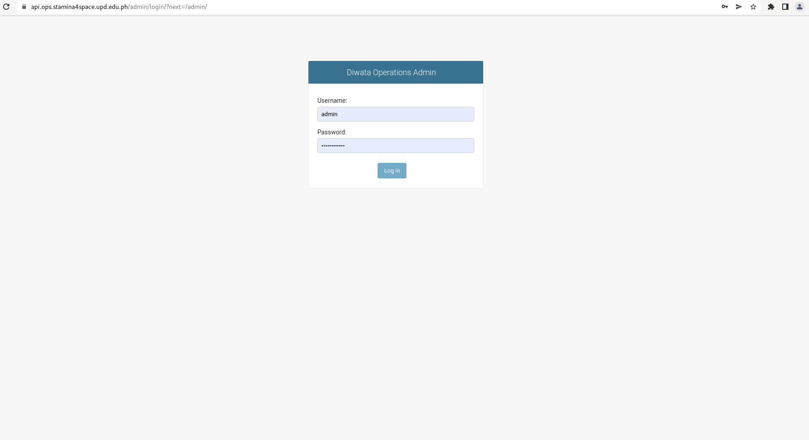

# Diwata Operations Software User Guide

The Diwata Operations Software (DOS) is an integrated system containing modules for
managing different components within the satellite operations workflow. The DOS is divided into
three major modules: Missions Management, Data Management, and Satellite Health
Management.

From an architectural standpoint, the DOS serves as a central repository of data for multiple software systems developed in GRASPED.

## Accessing the Website
The Diwata Operations Software may only be accessed by authorized users using this [link](https://ops.stamina4space.upd.edu.ph/).

## Missions Management
The Missions Management module was designed to help in mission planning and management of satellite passes. This module includes automated pass prediction features, similar to the Microsatellite Scheduler, as well as a satellite command generator.

### Acquisition Missions
### Upload Missions
### Download Missions
### Commands and Command Batches
### Reports

## Data Management
The Data Management Module contains tools for storing and accessing images and metadata in different levels of data processing. In this module, users may download images for processing and upload derived products.

A Data Processing Pipeline is also integrated into the module to automate most of the existing Diwata-1 and Diwata-2 Level 1 product generation.

## Satellite Health Management
### ACU Logs
Attitude Control Unit (ACU) log files contain information recorded onboard the satellite describing the state of its positioning and orientation at a given time. The ground station operators download the log files regularly from the satellites and upload them into a cloud service.

Originally, the contents of the files can be inspected by manually running a depacketer software. This process was tedious and only provided information on-demand.

## Admin Management
Alternatively, users can login directly to the operations software backend to have additional access to the database especially when correcting data that are not editable in the Diwata Operations Software. For security purposes, however, not all users who have access to the Diwata Operations Software can login to the admin site. Some users may have limited access as well to protect data integrity. Users can access the site using this [link](https://api.ops.stamina4space.upd.edu.ph/admin/).

Upon logging in, the user will see all the accessible modules and data for viewing, adding, editing, and deleting. Access to these data and modules depends on the permissions granted to the user.

## Links
- [Operations Software](https://ops.stamina4space.upd.edu.ph/)
- [Operations Software Admin Site](https://api.ops.stamina4space.upd.edu.ph/admin/)
- [Operations Software on Gitlab](https://gitlab.com/grasped/operations-software/)
