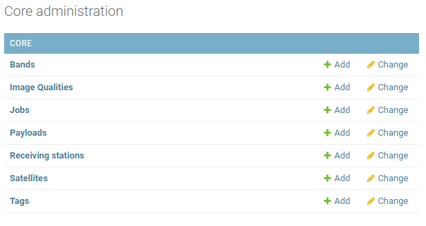
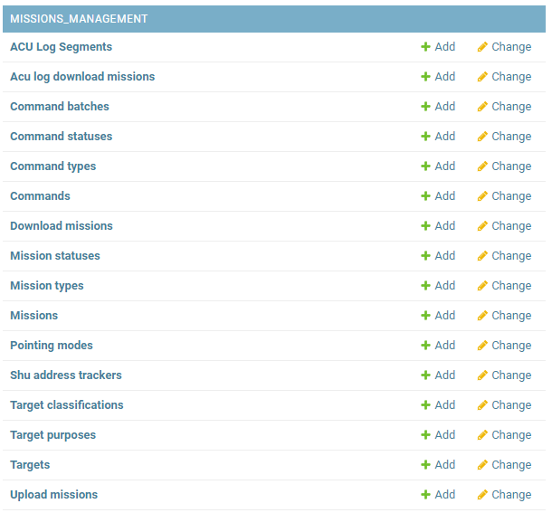
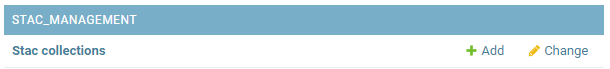
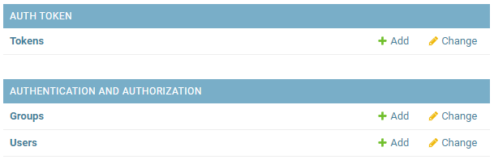
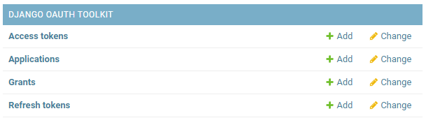

# Diwata Operations Software Admin Guide

This page contains information on the Operations Software's admin page and other tools to manage data stored in the software.

## Core
The Core Module contains the admin management for the addtion, update, and deletion of core technical information used in other modules.

This module consist of different models.

The models are described in the table below.

| Model | Description |
| ----- | ----- |
| Band | This page and model is for used for managing band entries utilized by the Satellites.  |
| Image Quality | This page and model is for used for managing entries for image quality observed from a Capture in Data Management. |
| Job | This page and model is for used for managing job types - these are status names for processing task in the Operations-Software. |
| Payload | This page and model is for used for managing entries on payload or instrument used by Satellites. |
| Receiving Station | This page and model is for used for managing ground receiving stations location and information. |
| Satellite | This page and model is for used for managing entries of satellites being governed. |
| Tag | This page and model is for used for managing image tags - these are one-word text to give a Capture a context of the scenery. |

## Mission Management

## Data Management
The Data Management module contains tools for storing and accessing images and metadata in different levels of data processing. In this module, users may download images for processing and upload derived products.

A Data Processing Pipeline is also integrated into the module to automate most of the existing Diwata-1 and Diwata-2 Level 1 product generation.

This module consist of different models.

The models are described in the table below.

| Model | Description |
| ----- | ----- |
| Batch | This page and model is for used for managing information on batch download for Captures. It has information on the recipient of the download, the location of the zipfile, and the captures involved. |
| Capture Group Product | This page and model is for used for managing capture group product - these are images stiched together taken on a single pass. |
| Capture Group | This page and model is for used for managing identifier of group of Capture Group Products in a single pass. |
| Capture Status | An empty model. |
| Capture | This page and model is for used for managing capture data - these are the image itself and its metadata taken from a Satellite. |
| GCP File | This page and model is for used for managing Ground Control Points (GCP) files  - they are the file itself and file properties. |
| Image Tag | This page and model is for used for managing tags - these are unique identifier of Capture to give context of the scenery e.g. Agricultural. |
| Initial Image Assesment | An empty model. |
| Merged Raw Image |  |
| Processing Level | This page and model is for used for managing processing levels - these are identifiers of processing level of the image is e.g. L1A. |
| Product Type | his page and model is for used for managing product types of the image - these are the types of prodcuts of an image according to a processing level e.g. L1A. |
| Product | This page and model is for used for managing processing products - these are the image itself derived from a Capture and its information. |
| Raw Image |  |
| Telemetry File Type |  |
| Telemetry File |  |

The admin page for Data Management is not manually used since there are APIs on which user can add, update, and delete entries for each model. They are further discussed on [Data Management Module](../../technical/operations_software/index.md#data-management-module) technical guide.

## STAC Management
The Spatiotemporal Asset Catalog (STAC) Management module contains the management tool for STAC endpoints.

This module consist of different models.

| Model | Description |
| ----- | ----- |
| STAC Collection | This page and model is for used for managing STAC collections - they hold geojson objects that holds additional information for STAC Items within the Collection. |

## Other Admin Pages
Other admin pages are also present in the Admin Management. They are pages that manages the backend adminstration such as Users, Groups, Authentication, and etc.

