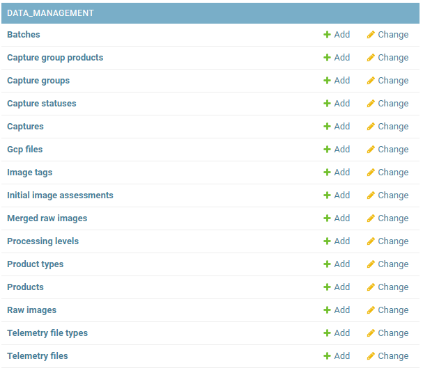

# Diwata Operations Software Admin Guide

This page contains information on the Operations Software's admin page and other tools to manage data stored in the software.

## Core
The Core Module contains the admin management for the addtion, update, and deletion of core technical information used in other modules.

The models are described in the table below.

## Mission Management

## Data Management
The Data Management Module contains tools for storing and accessing images and metadata in different levels of data processing. In this module, users may download images for processing and upload derived products.

A Data Processing Pipeline is also integrated into the module to automate most of the existing Diwata-1 and Diwata-2 Level 1 product generation.

In the admin page, the this module consists of different models.

The models are described in the table below.

| Model | Description |
| ----- | ----- |
| Batch | This model holds information on batch download for Captures. It has information on the recipient of the download, the location of the zipfile, and the captures involved. |
| Capture Group Product | It holds data and its information of images stiched together on a single pass. |
| Capture Group | It is an identifier of group of images in a single pass. |
| Capture Status | An empty model. |
| Capture | It holds the data and its information of individual image taken from a Satellite. |
| GCP File | It holds the data and information on Ground Control Points file. |
| Image Tag | It is an identifier of tags on an image e.g. Agricultural. |
| Initial Image Assesment | An empty model. |
| Merged Raw Image |  |
| Processing Level | It is an identifier what processing level the data is e.g. L1A. |
| Product Type | It is an identifier of the product type of the image e.g. L1A. |
| Product | It holds the data and information of individual derived product from a Capture. |
| Raw Image |  |
| Telemetry File Type |  |
| Telemetry File |  |

The admin page for Data Management is not manually used since there are APIs on which user can add, update, and delete entries for each model. They are further discussed on [Data Management Module](../../technical/operations_software/index.md#data-management-module) technical guide.

## STAC Management