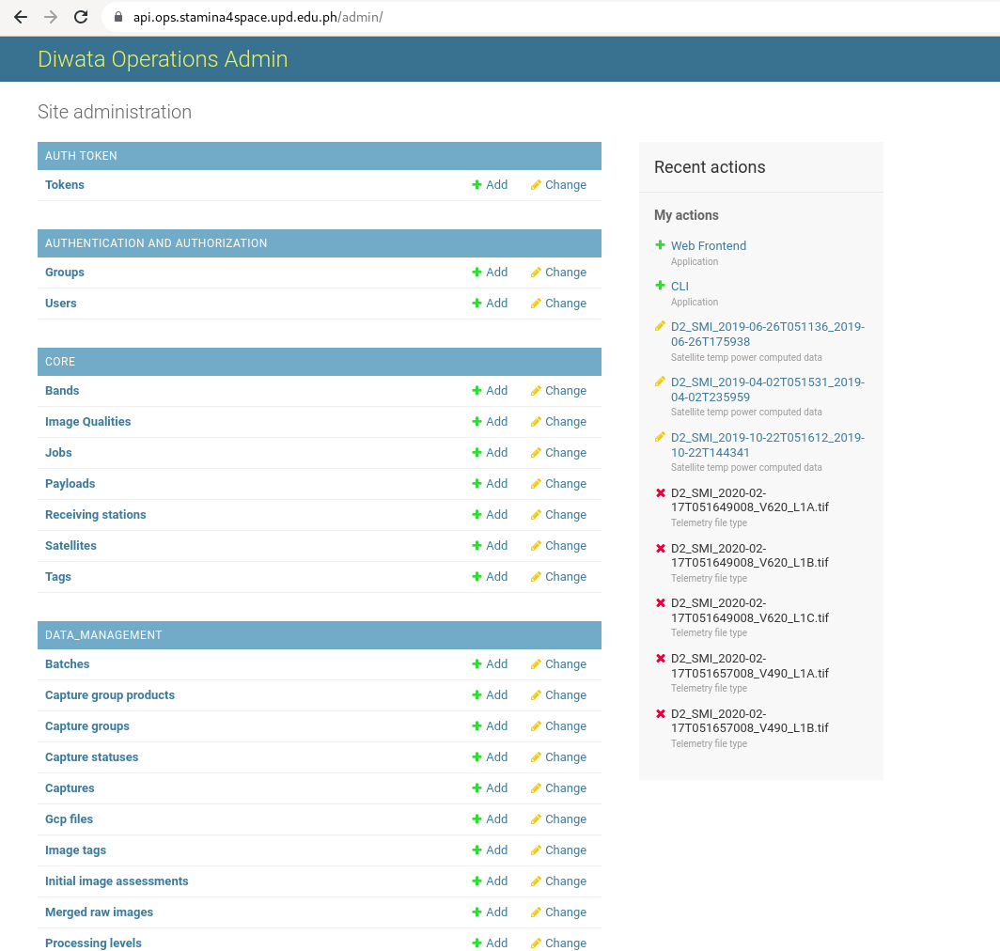
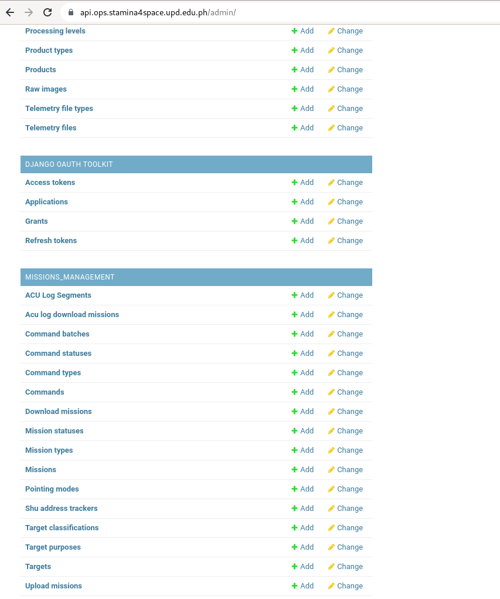
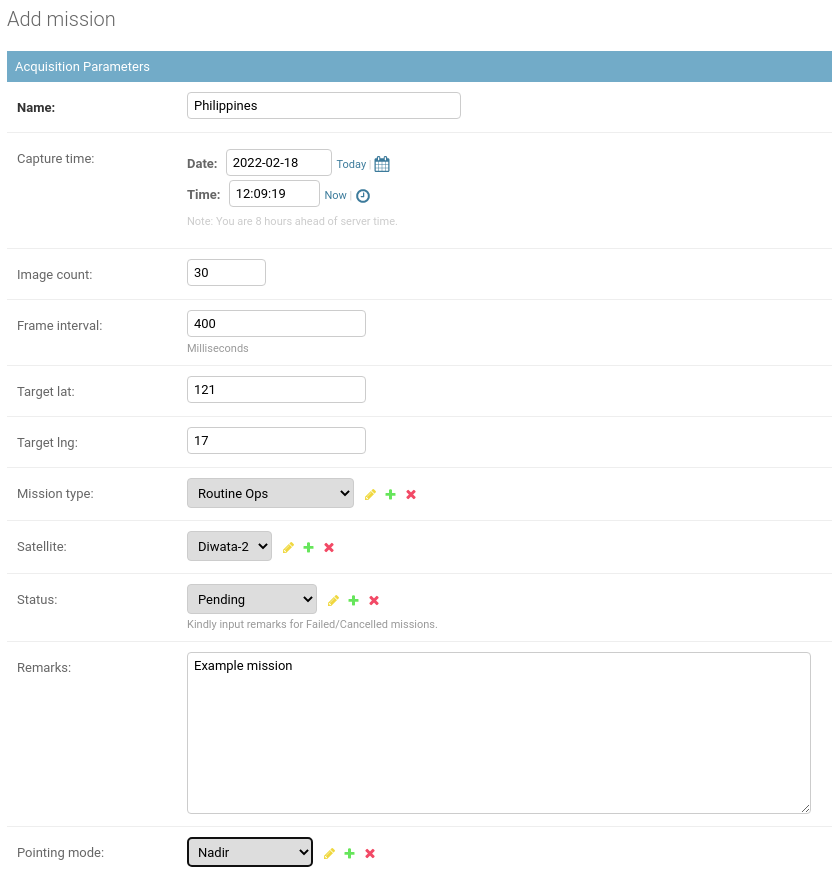
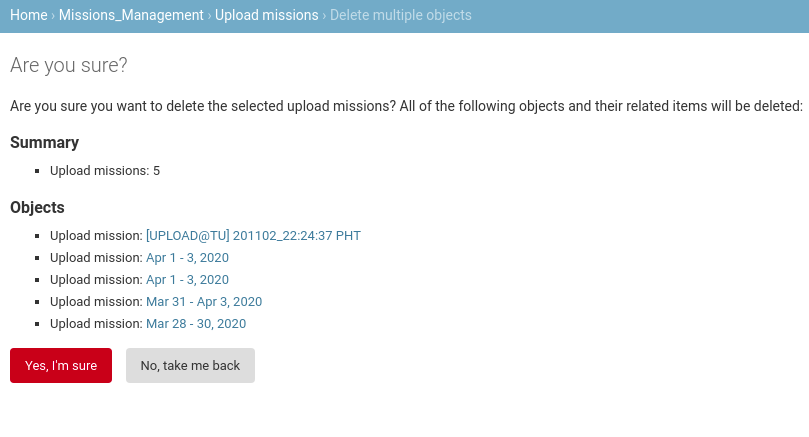
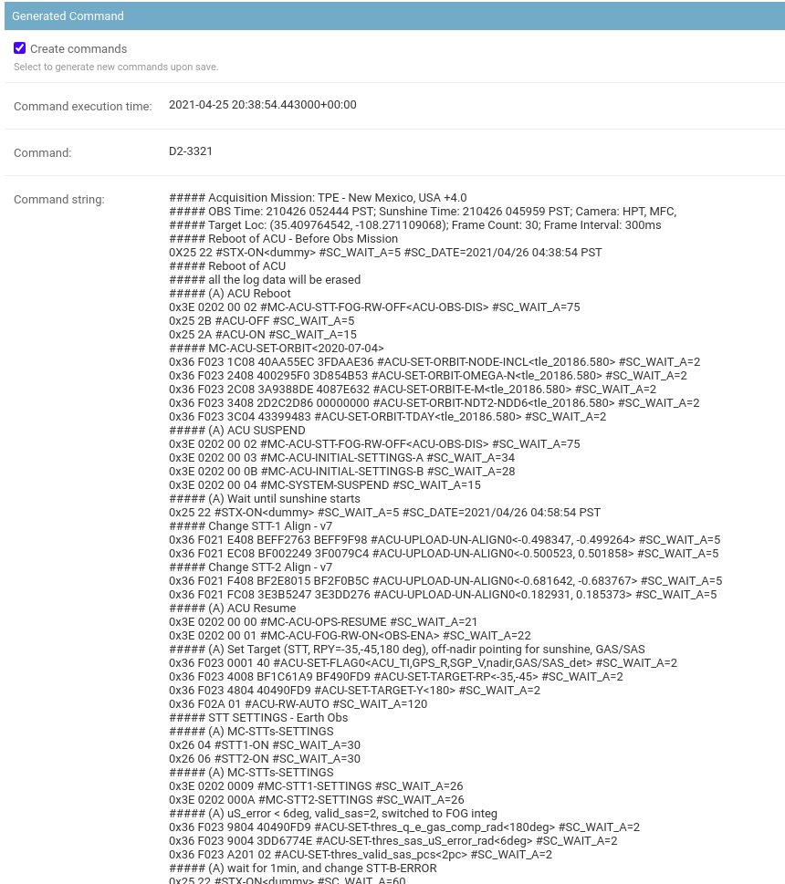

# Diwata Operations Software Admin Guide

This page contains information on the Operations Software's admin page and other tools to manage data stored in the software.

Users can login directly to the operations software backend to have additional access to the database especially when correcting data that are not editable in the Diwata Operations Software. For security purposes, however, not all users who have access to the Diwata Operations Software can login to the admin site. Some users may have limited access as well to protect data integrity. Users can access the site using this [link](https://api.ops.stamina4space.upd.edu.ph/admin/).

Upon logging in, the user will see all the accessible modules and data for viewing, adding, editing, and deleting. Access to these data and modules depends on the permissions granted to the user.

## Users Module

### Adding user accounts

1. Under the **Authentication and Authorization** group, select **Users** or click the **Add** button.

  Alternatively, you may also click the **Add User** button from the Users list.

2. Add the desired username and password. **Note:** Avoid using common passwords.

3. Click **Save** button. A message will confirm that the user has been saved and a dialog will open where you can edit user info and permissions.

You may select individual/multiple permissions for each user.

## Missions Management

### Acquisition Missions

#### Adding a new Acquisition Mission

1. Login to the admin site with your credentials. You may contact the system administrator if you still don't have an account.

2. Look for the Missions module under the MISSIONS_MANAGEMENT subgroup.

3. You may click the Missions button to view and update the current records or the Add button if you want to add a new record.

4. Add the necessary parameters for the mission, and then click Save. You may also choose Save and add another if you wish to save another record, or Save and continue editing if you don't want to view and edit the recorded data.

Some settings are Diwata-2 specific settings so you need to input necessary parameters for the compiler to work properly.

Unchecking this box will prevent the command compiler from executing.

Add the payloads to be used.

**Note:** As of April 5, 2020, generating commands for Diwata-1 will result in TLE errors because Diwata-1 has already been decommissioned. Command Compiler tries to fetch the latest TLE values from the server and will return an error if the TLE's epoch date is older than 7 days.

#### Batch operations for Acquisition Missions

1. Click on the checkbox beside each record to select a record. You may also click the uppermost checkbox to select all the records in the current page.

2. Open the dropdown menu above the table and select the action you want to perform. Then, click Go. 

A prompt will be shown when trying to delete records. Review and confirm that the data can be deleted before proceeding.

**Note:** Please be careful when deleting multiple data. 

### Upload Missions

#### Adding a new Upload Mission

1. Login to the admin site with your credentials. You may contact the system administrator if you still don't have an account.

2. Look for the Upload missions module under the MISSIONS_MANAGEMENT subgroup.

3. You may click the Upload missions button to view and update the current records or the Add button if you want to add a new record.

4. Add the necessary parameters for the upload mission, and then click Save. You may also choose Save and add another if you wish to save another record, or Save and continue editing if you don't want to view and edit the recorded data.

**Note:** Unchecking Generate commands will prevent the command compiler from executing. This means that the error below will not occur and the record will still be successfully saved but without the generated commands.

**Note:** As of April 5, 2020, generating commands for Diwata-1 will result in TLE errors because Diwata-1 has already been decommissioned. Command Compiler tries to fetch the latest TLE values from the server and will return an error if the TLE's epoch date is older than 7 days.

#### Batch operations for Upload Missions

1. Click on the checkbox beside each record to select a record. You may also click the uppermost checkbox to select all the records in the current page.

2. Open the dropdown menu above the table and select the action you want to perform. Then, click Go. 

A prompt will be shown when trying to delete records. Review and confirm that the data can be deleted before proceeding.

**Note:** Please be careful when deleting multiple data. 

### Download Missions

#### Adding a new Download Mission

1. Login to the admin site with your credentials. You may contact the system administrator if you still don't have an account.

2. Look for the Download Missions module under the MISSIONS_MANAGEMENT subgroup.

3. You may click the Download Missions button to view and update the current records or the Add button if you want to add a new record.

4. Add the necessary parameters for the mission, and then click Save. You may also choose Save and add another if you wish to save another record, or Save and continue editing if you don't want to view and edit the recorded data.

Some settings are Diwata-2 specific settings so you need to input necessary parameters for the compiler to work properly.

Unchecking this box will prevent the command compiler from executing.

Add the bands, starting addresses, and number of images to be downloaded, respectively.

**Note:** As of April 5, 2020, generating commands for Diwata-1 will result in TLE errors because Diwata-1 has already been decommissioned. Command Compiler tries to fetch the latest TLE values from the server and will return an error if the TLE's epoch date is older than 7 days.

#### Batch operations for Download Missions

1. Click on the checkbox beside each record to select a record. You may also click the uppermost checkbox to select all the records in the current page.

2. Open the dropdown menu above the table and select the action you want to perform. Then, click Go. 

A prompt will be shown when trying to delete records. Review and confirm that the data can be deleted before proceeding.

**Note:** Please be careful when deleting multiple data. 

**Note:** As of April 5, 2020, generating commands for Diwata-1 will result in TLE errors because Diwata-1 has already been decommissioned. Command Compiler tries to fetch the latest TLE values from the server and will return an error if the TLE's epoch date is older than 7 days.

### ACU Log Download Missions

#### Adding a new ACU Log Download Mission

1. Login to the admin site with your credentials. You may contact the system administrator if you still don't have an account.

2. Look for the ACU Log Download Missions module under the MISSIONS_MANAGEMENT subgroup.

3. You may click the ACU Log Download Missions button to view and update the current records or the Add button if you want to add a new record.

4. Add the necessary parameters for the mission, and then click Save. You may also choose Save and add another if you wish to save another record, or Save and continue editing if you don't want to view and edit the recorded data.

Unchecking this box will prevent the command compiler from executing.

#### Batch operations for ACU Log Download Missions

1. Click on the checkbox beside each record to select a record. You may also click the uppermost checkbox to select all the records in the current page.

2. Open the dropdown menu above the table and select the action you want to perform. Then, click Go. 

A prompt will be shown when trying to delete records. Review and confirm that the data can be deleted before proceeding.

**Note:** Please be careful when deleting multiple data. 

### Commands and Command Batches

Commands are generated by default whenever missions are created. The list of commands can be found in the Command module of Missions Management module.

#### Viewing and Editing commands

1. Upon clicking the **Commands** button, you will see all the generated commands from all the different missions (acquisition, download, etc.). Click on the ID to view/edit the content of a command.

2. Edit the content part of the command and click **Save**.

**Note:** Commands that are created using the Add command module cannot be linked to an existing mission. To be able to link a mission and a command, create a mission and then find the generated command and edit it. Command compiler will execute everytime **any of the three Save** button is pressed. To prevent the command from being replaced, uncheck the **Create commands** button before saving the mission.

#### Creating command batches
Command batches are a group of commands. It may be a combination of upload, download, acu log download, and acquisition missions. 

1. To create a batch, go to the **command batches** module or click the **Add** button.

If you're already on the list of command batches, you may click the **Add Command batch** on the top right corner of the site.

2. Add the necessary parameters needed.

This part will reflect the generated batch after saving the command batch.

Supply the ID of the command that will be added to the batch. To select from the list of commands, you may click the search icon beside the text box.

 A window with the list of commands will popup. Selecting the ID will supply the text box with the command.

Alternatively, you may input the ID of the command in the text box provided.

## Data Management
